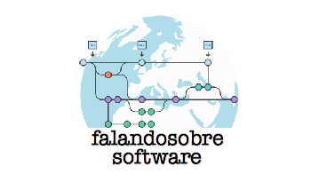
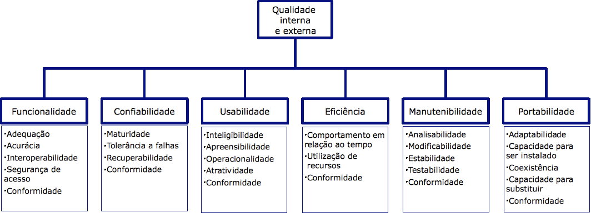
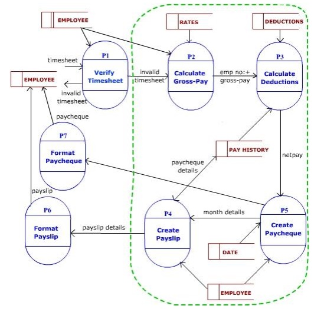
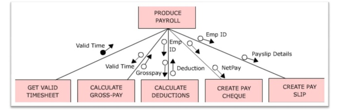

# Papo sobre software, com quem entende!

(c) 2020 [**Cleuton Sampaio**](https://github.com/cleuton).

# Arquitetura flexível 
**Cuidados com a arquitetura do software em projetos ágeis**

*Russian rhythmic gymnast Irina Chaschina stretching. This is an example of an oversplit, or a split that exceeds 180 degrees (Mollerjoakim - Wikimedia)*

O que significa software **flexível**? De acordo com **Anders Karlsen**, em seu artigo na [**Medium**](https://medium.com/faun/flexibility-a-software-architecture-principle-6eafe045a1d4):

*An important capability for businesses to thrive and grow, and even survive, is the ability to react and adapt to change. This relates to customer needs, expansion into new markets, or utilizing the latest and greatest in technology. The software systems that businesses rely upon must reflect this.*

*(Uma importante capacidade para os negócios prosperarem e crescerem, e mesmo sobreviverem, é a habilidade de reagir e se adaptar à mudança. Está relacionada com as necessidades dos clientes, expansão para novos mercados ou utilizar as mais atuais e melhores tecnologias. Os softwares nos quais o negócio se apoia, devem refletir isto)*

Muito bem colocado. Eu não definiria melhor. **Flexibilidade** é a capacidade de um software (do ponto de vista de seu código-fonte) de ser adaptado às novas necessidades. É mais do que a simples **Manutenibilidade**: 

*Em engenharia de software, manutenibilidade é um aspecto da qualidade de software que se refere à facilidade de um software de ser modificado a fim de corrigir defeitos, adequar-se a novos requisitos, aumentar a suportabilidade ou se adequar a um ambiente novo. Tais atividades são conhecidas como a manutenção de software, assim como definido pela ISO/IEC 9126. (Wikipedia)* 

Enquanto a **manutenibilidade** está mais preocupada com a manutenção do software, a **flexibilidade** visa preservar o investimento que a Empresa fez, permitindo adaptações a novas necessidades, talvez imprevistas no momento em que o software foi criado.

A questão importante é: *Como podemos garantir a maior flexibilidade possível para nosso software?*

## Arquitetura de software

Este papel é da [**arquitetura de software**](https://pt.wikipedia.org/wiki/Arquitetura_de_software). A arquitetura se preocupa em produzir um software com as melhores capacidades possíveis, de preferência, seguindo normas internacionais, como a ISO 9126 (NBR 13596): 

A **flexibilidade** está distribuída nos itens: **Manutenibilidade** e **Portabilidade**. 

Em todos os processos de desenvolvimento, há um momento ou fase dedicado ao projeto da arquitetura do software, pois ela determina como o software se comportará. 

**Mas e nos projetos ágeis?**

Realmente, hoje em dia utiliza-se **métodos ágeis** para construir software. Na verdade, um **amálgama** composto por: **Scrum**, **Planning Poker** e **Kanban**. É claro que existem outros métodos ágeis, como **Test Driven Development**, **Extreme Programming** e **Behavior Driven Development**, mas estes tem sido relegados ao segundo plano e nem todas as equipes ditas **ágeis** os utilizam. Mas usam **Scrum**!

O próprio **Scrum** não é exatamente um método ágil. É um **framework** para condução de projetos em geral, não necessariamente de software. Portanto, não há um momento especial para pensar a arquitetura. O excelente artigo do [**DZone**](https://dzone.com/articles/what-is-software-architecture-in-scrum) explica isso muito bem: 

*... there is no special moment for the design of the software architecture in Scrum. There is no "software architecture Sprint." Architecture in Scrum emerges, it is not created somewhere, or at some specific time.*

*(não existe um momento especial para o projeto da arquitetura do software no Scrum. Não existe um Sprint de arquitetura de software. No Scrum, a Arquitetura emerge, não sendo criada em algum lugar, ou em algum momento específico.)*

O que significa dizer que "a Arquitetura emerge"? Quem se preocupa com desenvolvimento de software, ou de qualquer tipo de projeto, como a construção de uma casa, sabe que a Arquitetura é fundamental e que deverá guiar o desenvolvimento do Projeto. 

Alguns dizem que no Scrum, a arquitetura vai sendo construída durante os Sprints. Porém, o objetivo dos Sprints é produzir algo **potencialmente entregável** e a arquitetura do software não é esse tipo de produto. 

**Inception**

É claro que o **Scrum** sozinho não funciona. É necessário um pré-planejamento antes de iniciar o primeiro Sprint. Então, foi pensada uma técnica chamada de [**Inception**](https://www.thoughtworks.com/pt/insights/blog/inception-o-que-quem-onde-quando-como-0), durante a qual a equipe começa a trabalhar os requisitos e alto nível, estima o tamanho total do Projeto e elabora uma estratégia incremental de MVPs ([Produto Mínimo Viável](https://www.significados.com.br/mvp/)). Esta técnica dura, geralmente, uma semana, e participal todos os principais interessados: Desenvolvedores, gestores e até clientes.  

É claro que em uma semana, com um monte de assuntos a serem discutidos e um batalhão de postits nas paredes, não dá para discutir todos os aspectos da Arquitetura. Dá para pensar em linhas gerais, deixando o resto para ser feito durante os Sprints. 

Isso é a mesma coisa de fazer o seguinte: Será uma casa de dois andares e 4 quartos. O resto (aquecimento, refrigeração, materiais, ecologia, ergonomia) será visto durante a construção. Agora, imagine o impacto dessa abordagem, quando no meio dos Sprints eles descobrem que na casa morarão crianças com menos de 3 anos, ou idosos, ou mesmo cadeirantes? Sabe projetar uma casa para um cadeirante? Pensou nisso? Este é um exemplo de como essa abordagem é falha e gera produtos com capacidades abaixo do ideal.

**Mas isso não é um problema!**

Ah, não? Então voltemos ao projeto de software. Quando destacaremos os componentes **arquiteturalmente significativos**? Quando pensaremos as **interfaces externas**? Quando discutiremos a **modularização** do projeto como um todo? Durante a **inception**? Claro que não.

Estes itens que eu mencionei são extremamente importantes e são responsabilidade do Arquiteto de Software: 

- Componentes **arquiteturalmente significativos**: São os componentes de maior risco! Simples assim. São aqueles em cujo projeto e construção há mais incertezas, e que podem comprometer todo o projeto ([system's significant components](https://sceweb.uhcl.edu/helm/RationalUnifiedProcess/process/workflow/ana_desi/co_swarch.htm));
- **Intefaces externas**: São os protocolos, estruturas de dados e meios de integração entre os componentes arquiteturalmente significativos entre si e para fora do futuro sistema. Devem estar claramente definidas desde o início, de modo que os desenvolvedores possam segui-las. Isso garante uma integração mais fácil;
- **Modularização**: É a divisão do sistema em partes distintas e estanques, com baixa dependência, de modo a garantir a manutenibilidade e a flexibilidade do futuro sistema. É a parte mais importante relacionada com **flexibilidade**!

E então? Acha que dá para pensar essas coisas na **inception**? E durante os Sprints, quando a equipe já está efetivamente construindo MVPs? Claro que não. 

Na minha opinião, baseada em mais de 41 anos de experiência, tendo passado por várias metodologias e processos, acredito que a abordagem ágil se aplique a produzir software **descartável**, ou seja: **protótipos**. Ou melhor: SEMPRE MVPs! Mas não visa construir software robusto e flexível, que permita maximizar o **ROI** (retorno do investimento) que a Empresa fez em sua construção.

Veja bem, essa é uma estratégia de gestão de TI: Construir software descartável e estar sempre desenvolvendo novas versões. O problema é que esses MVPs nem sempre possuem as capacidades necessárias, e acabam sendo costurados, reformados, remendados e mutilados em função disso.

## Projetando uma arquitetura flexível

Uma arquitetura flexível deve garantir a maior **flexibilidade** possível ao software construído. Para isto, temos que combater o principal problema, causado pela falta de um projeto arquitetural sério: [**Britleness**](https://en.wikipedia.org/wiki/Software_brittleness):

*When software is new, it is very malleable; it can be formed to be whatever is wanted by the implementers. But as the software in a given project grows larger and larger, and develops a larger base of users with long experience with the software, it becomes less and less malleable. Like a metal that has been work-hardened, the software becomes a legacy system, brittle and unable to be easily maintained without fracturing the entire system. (Wikipedia)*

*(Quando o software está novo, é muito maleável; pode ser criado para ser qualquer coisa desejada pelos seus implementadores. Mas, quando o software in um projeto cresce mais e mais, e agrega uma grande base de usuários, com grande experiência nele, se torna menos e menos maleável. Com um metal que acabou de ser trabalhado, o software se torna um sistema legado, quebradiço e difícil de ser mantido sem fraturar todo o sistema)*

O **britleness** aparece muito em textos sobre **clean coding**, ou seja, falta de emprego de boas práticas de engenharia de software em sua manutenção. Mas, na verdade, as causas também podem estar na própria arquitetura, ou na falta dela. 

Vamos a um exemplo prático. Em um software de e-commerce, um desenvolvedor precisa alterar o algorítmo de análise de crédito dos clientes, para incluir uma nova modalidade. Porém, ao analisar o principal componente, descobre que há um **acoplamento de conteúdo** dentro do código-fonte, e, por isso, precisa alterar em outro ponto no código. E essa alteração produz um erro em mais outro componente, que tem um acoplamento grande com o anterior. Isso é **britleness**.

As principais medidas para uma arquitetura flexível são: **baixo acoplamento** entre módulos e **alta coesão** interna dos mesmos. 

Você pode estudar mais sobre **acoplamento e coesão** neste excelente livro, de [**Meilir Page-Jones**](https://www.amazon.com.br/Projeto-Estruturado-Sistemas-Meilir-Page-jones/dp/007450228X):

Mas existem outras fontes, como estes artigos: 

- [**Coupling (computer programming)**](https://en.wikipedia.org/wiki/Coupling_(computer_programming));
- [**Entendendo Coesão e Acoplamento**](https://www.devmedia.com.br/entendendo-coesao-e-acoplamento/18538);
- [**Coesão e Acoplamento em Sistemas Orientados a Objetos**](https://www.devmedia.com.br/coesao-e-acoplamento-em-sistemas-orientados-a-objetos/16167);
- [**Software Engineering | Coupling and Cohesion**](https://www.geeksforgeeks.org/software-engineering-coupling-and-cohesion/)

A técnica de [**Análise de Transformação**](http://www.brainkart.com/article/Software-Design--Transform-Analysis_9291/) pode ajudar você a criar uma arquitetura flexível, embora seja antiga, é perfeitamente adaptada a qualquer tipo de paradigma de programação (estruturado, orientado a objetos, funcional) e método de desenvolvimento (cascada, iterativo, ágil).

A ideia é mapear seus requisitos na forma de um fluxo de dados, como este: 

Em um diagrama de estrutura de módulos, como este: 

Ninguém pode afirmar que um [**DFD**](https://pt.wikipedia.org/wiki/Diagrama_de_fluxo_de_dados) ou um diagrama de módulos são incompatíveis com **orientação a objetos** ou **programação funcional**. E servem para duas coisas: Dar visibilidade à realização dos requisitos e à modularização do futuro sistema aplicativo. 

## Conclusão

Precisamos resgatar as boas práticas da Arquitetura e Engenharia de software, se quisermos construir software flexível, aumentando o retorno do investimento e a lucratividade das empresas. 

Algumas técnicas que mencionei aqui viraram **peças de museu** sem nenhuma necessidade ou explicação para isto, mas podem ser resgatadas e utilizadas com qualquer paradigma de programação ou modelo de processo de desenvolvimento. 

Cleuton Sampaio, M.Sc.
