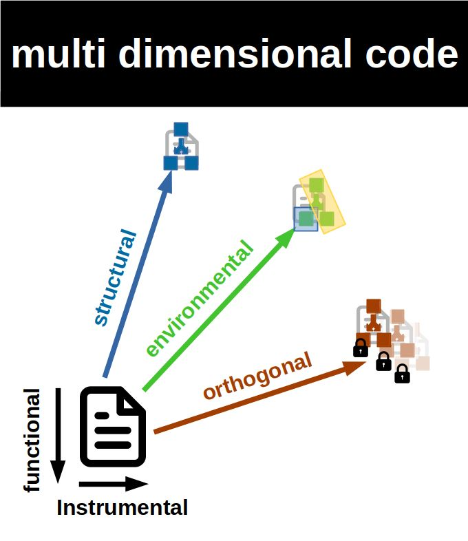
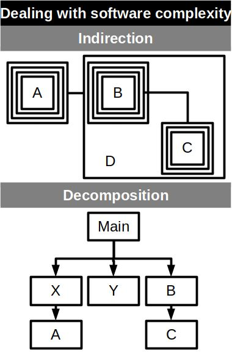
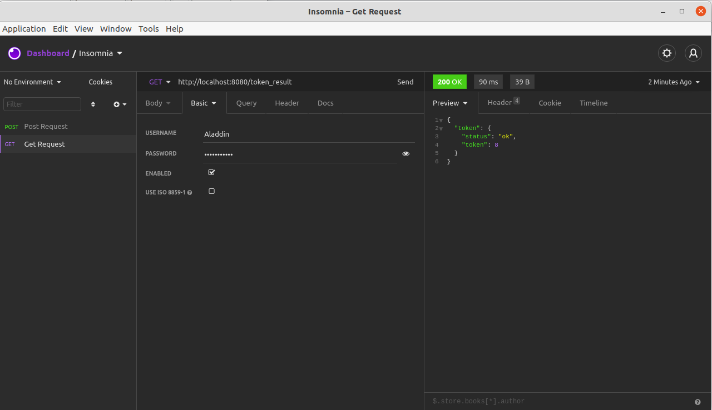

# Flat code: Less code more software

[*Cleuton Sampaio*](https://github.com/cleuton)

<a rel="license" href="http://creativecommons.org/licenses/by/4.0/"></a><br />Este obra está licenciado com uma Licença <a rel="license" href="http://creativecommons.org/licenses/by/4.0/">Creative Commons Atribuição 4.0 Internacional</a>.


Flat Code is a new way to build software, more productive and objective:
- **Focused**: The source code should only be concerned with the main function. Aspects such as: Security, scalability and high availability, should be left to the IT Infrastructure;
- **Simple**: No class structures or complex patterns. The ideal is to create the simplest code possible, after all, it must be disposable and easily replaceable;
- **Single responsability**: The code must have one and only one function;
- **Functional**: You must build the code by chaining pure functions, avoiding loops, "ifs" and side effects, reducing the complexity of the code;
- **Cloud native**: Build your code as decoupled services, following the principles of Function as a Service, making it simple to serve with mechanisms like clouds or containers;
- **Pluggable**: The code must have a simple, reduced (ISP) and obvious (POLA) interface, using standard mechanisms and protocols for interoperability;

## What is the opposite of flat code?

Well, I usually call it **multidimensional** code or **FatCode**.



Multi dimensional code is the opposite of Flat code, that is, there are many more dimensions of concern for the programmer, in addition to the 2 mandatory ones, which would be: 
- **Functional**: What the code has to do;
- **Instrumental**: The instruments (functions and APIs ) that the chosen programming language provides. 

These other dimensions are:
- **Structural**: The complex data and class structures, loops, "ifs" and design patterns that need to be followed;
- **Environmental**: The frameworks that the programmer must obey, whether by choice or imposed by the Company;
- **Orthogonal**: Aspects that the programmer needs to be concerned with, such as: Scalability, Security and High availability, which should be left to the IT Infrastructure.
Flat code is a guideline to be followed, which makes the code simpler, increasing the programmer's productivity and the Company's profitability. We cannot always eliminate all dimensions, but we can reduce them.

## Tell me more...


The idea of proposing the flat code is not to replace or oppose the current programming paradigms, but to offer lighter alternatives to increase the productivity and profitability of companies.
In no way does it mean that using other paradigms and methods is bad or worsens productivity.
It is just a different way of approaching software development.

We live in a time when the IT infrastructure has advanced a lot, absorbing tasks that would previously have been specific to development, and allowing us to reduce the number of problems that we have to worry about when coding the software.

At the same time, we are constantly inflating our source code with complex structures and frameworks, whose benefits end up being diluted in a sea of accidental complexity. In a world where agile methods dominate software projects, this complexity ends up reducing productivity and profitability, as we spend more time doing things whose benefits we still cannot account for.

I wrote an article on Hackernoon detailing this issue of accidental complexity, which is related to the YAGNI (You Ain't Gonna Need It) effect: [**Reasons to Flatten your Source Code**](https://hackernoon.com/reasons-to-flatten-your-source-code-nt4033nm)


> The decades pass, but we still write software in the same way as in the XX century.
> Our software is a large castle, formed by several layers superimposed and mixed, in order to facilitate its own maintenance, but which, in fact, end up creating the opposite effect: a true monolith.

## Dealing with complexity

There are basically two ways to deal with software complexity: Indirection, which means adding layers of abstraction, and decomposition, which means breaking down the problem into smaller parts. Although there are at least two ways, I have the impression that most developers prefer Indirection as a solution. Creating layers and layers of abstraction, whether using design patterns or not.



## Frameworks: Spider webs that bind you, the software and the company together

I have a certain dislike for frameworks, I believe that, in most cases, they add less value than accidental complexity to the code. And, to make matters worse, many frameworks have an aggressive roadmap, with destructive upgrades in most cases, and you are forced to upgrade or settle for an old version.
And, anyway, frameworks are designed to entangle your software in a web that is difficult to break. I usually say this:

> Frameworks are solutions that you don't need, for problems that you don't have.

The question is: *Can we develop software without using any framework?*

Due to the diversity of platforms and the need for interoperability, probably not. But it is possible to reduce the dependence on these frameworks, isolate the code that uses them to avoid its propagation.

## Aspects must be externalized

There are several aspects of software that can and should be externalized today. I usually say that they are aspects orthogonal to the function of the software, as they are usually invariant, that is, regardless of the functionality to be implemented, the external or extrinsic aspects follow their own needs and standards.

I like to cite as examples:
- Security: Authentication and authorization, which nowadays depend more on external mechanisms, such as LDAP or SAML, than on the internal implementation in the software;
- Scalability: Ability to expand the use and availability of resources to meet the growing demand for software use;
- High availability: Ability to continue working and serving users even in the event of equipment failures;

With modern infrastructure resources, such as: Containers, Orchestrators and FaaS servers, we must leave these extrinsic aspects to the IT infrastructure, rationalizing our investments and expenses.

# I see a lot of small talk and no code


Ok. Let's show you a very simple example, to demonstrate how we introduce extra dimensions in the source code, without real need. Usually this process starts with the user's story, because instead of thinking about understanding the problem to give a solution, we actually think about how to solve the problem using our "arsenal" of preferred tools and solutions.

Let's assume that the user passed the following report to the team:

> We need a module that returns the value of a parameter to the Customer. The provided parameter is the term number of the progression given by the formula:
> F1 = 1, F2 = 1
> Fn = Fn-1 + Fn-2
> Depending on the parameter, the calculation takes a long time and this cannot happen.
> The term number (parameter) is the character size of the user name. To limit the time spent, we accept between 2 and 15 characters. If the parameter is outside this range, use the value 5.
> An important point is that today we use this function, but this may change in the future.
> Many users will access this module simultaneously. It will be integrated into the existing web application today.

*(Yes ... It's the term function of the Fibonacci sequence, but let's ignore it for now. Let's pretend it's just any function)*

**If you could ask the user something, what would it be?**

This requirement was part of a lesson that I passed on to my students. I always asked to list these questions. I took the opportunity to pass this text on to some professional developers and, to my surprise, they asked the same questions: 

- What are the security requirements to access this function?
- How many users can access this simultaneously?
- Can we implement it as an asynchronous request?

After presenting this case to a few hundred people, among students and colleagues, only a few asked the really relevant questions:
- This function looks like a deterministic finite-state machine, since it always returns the same result for the same input. Can we replace it with a database table or something similar?
- What would be the maximum tolerable response time?

I intend to show how students (and some developers) implemented this story, so I will consider at this point only the 3 most common questions and possible answers from the user:

- What are the security requirements to access this function? *The same of the web app*
- How many users can access this simultaneously? *Potentially the same number of users that we have today: around 2,500*
- Can we implement it as an asynchronous request? *Do as you like, just pay attention to the short deadline we have* 

## Solving the traditional way

The developers get together to discuss the story:

**Dev #1**:

It is not difficult to conclude that this story would be better implemented as a RESTful service, as it would be loosely coupled and could integrate with any application that needed it. As we are already using the **Python** language, we will use the [Flask framework](https://flask.palletsprojects.com/en/1.1.x/) to implement this service.

**Dev #2**:

And, as the user said that this story would change in the future, we need to ensure the flexibility and maintainability of the source code, so we can use abstractions and design patterns to achieve this goal.

For example, we can use Strategy (abstract and concrete) being instantiated by an Abstract Factory. So, even if the story changes a lot and other types of calculations are needed, we can minimize the impact on the source code.

**Dev #3**:

We must remember security! We need some form of access control ... I assume that the user will already be authenticated, but it is necessary to verify this before invoking the function.

**Dev #4**: 

What about scalability and high availability? Each request can have a variable processing time and may need to be executed asynchronously. We can divide it into 2 requests: One to request the calculation and the other to verify that it has already been completed. And we can use something like a thread pool to perform the calculations.

> YAGNI alert: So far, only future possibilities have been discussed, not current needs.

Am I exaggerating? Would this hypothetical discussion among developers ever happen? Well, I followed some groups of students implementing this exercise and the discussions went more or less that way.

You can see the implemented code in the folder [**fatcode_sample**](../fatcode_sample) Now, let's look at some of the solutions adopted by the developers to solve the problem raised in the story.

### Structural dimension

They implemented the Abstract Factory and Strategy patterns to abstract the calculation function, allowing the same code to work for several different types of functions. Let's look at the folder [./fatcode_sample/business](../fatcode_sample/business). In the business / factories folder, they created an Abstract Factory to instantiate the strategy to be used in the calculation:

```
from business.abstract_strategy import AbstractStrategy
from abc import ABC, abstractmethod
class AbstractFactory(ABC):

    @abstractmethod
    def create_calc_strategy(self) -> AbstractStrategy:
        pass
```

In the business folder is the Abstract Strategy class used to perform the calculation:

```
from abc import ABC, abstractmethod
class AbstractStrategy(ABC):

    @abstractmethod
    def calculate(self,name):
        pass
```

In the business/concrete folder we have the concrete strategy class:

```
from business.abstract_strategy import AbstractStrategy
from business.token_function import calc_token

class ConcreteStrategy(AbstractStrategy):
    def calculate(self,name):
        if len(name) < 3 or len(name) >15:
            tamanho = 5
        else:
            tamanho  = len(name)
        result = {}
        result['name']=name
        result['token']=calc_token(tamanho)
        return result
```

And this is the function that performs the calculation itself:

```
def calc_token(n):
	if n<0:
		return -1
	elif n==1:
		return 0
	elif n==2:
		return 1
	else:
		return calc_token(n-1) + calc_token(n-2)
```

Finally, we can see the concrete Factory class that instantiates the concrete strategy to be used:

```
from business.concrete.concrete_strategy import ConcreteStrategy
from business.factories.abstract_strategy_factory import AbstractFactory
class ConcreteFactory(AbstractFactory):
    def create_calc_strategy(self) -> ConcreteStrategy:
        return ConcreteStrategy()
```

To simplify things, the decision of which Factory to use is in the code of the main server ("servidor.py"), but it could be injected through some dependency injection mechanism:
```
factory = ConcreteFactory()
```

In this way, the source code of the business layer does not know which concrete strategy is being used, avoiding unwanted dependencies. The business layer code receives an instance of the abstract factory:

```
def start_calc (factory: AbstractFactory, name, poolx):
    strategy = factory.create_calc_strategy()
    results_group.addResult(name)
    future=poolx.submit(strategy.calculate,name)
    future.add_done_callback(set_result)
    result = {'future':future}
    return "wait"
```

### Environmental dimension

As it was decided to use the Flask framework to create a RESTful service, we have the framework code interspersed with the application code inside the file "servidor.py". Although it is reasonably separate, it is still a concern for the developer. 

The code involved with the framework is also making business decisions and invoking specific functions.

### orthogonal dimension

There was great concern here. We have the security part, which can be seen on "servidor.py":

```
@auth.verify_password
def verify_password(username, password):
    if username in users and \
            check_password_hash(users.get(username), password):
        return username


@app.route('/token', methods=['POST'])
@auth.login_required
def ask_token():
    result = {}
    result["token"] = business_layer.start_calc(factory,auth.current_user(),poolx)
    return json.dumps(result)
```

It was decided to use the flask_httpauth framework to deal with the source code authentication and authorization problem. In this first version, they embed users in the application, but later they will migrate to the same database that controls the security of the Web application. They will receive an Authorization Header for the application that contains the user currently logged in.It was decided to use the flask_httpauth framework to deal with the source code authentication and authorization problem. 

Another aspect that was of concern was scalability. Since the calculation could take a long time, they decided to implement a thread pool to handle the calculations. This can be seen in the "server.py" and in "business_layer.py":

```
poolx = concurrent.futures.ThreadPoolExecutor(max_workers=config.get('max_threads'))
```

```
class Results:
    results={}
    def __init__(self):
        self.lock = threading.Lock()
    def addResult(self,name):
        with self.lock:
            self.results[name]={}
            self.results[name]['token']=-1
    def updateResult(self,name,token):
        with self.lock:
            self.results[name]['token']=token

    def removeResult(self,name):
        with self.lock:
            del self.results[name]

results_group = Results()

def set_result(future):
    global results
    result = future.result()
    results_group.updateResult(result['name'],result['token'])
    

def start_calc (factory: AbstractFactory, name, poolx):
    strategy = factory.create_calc_strategy()
    results_group.addResult(name)
    future=poolx.submit(strategy.calculate,name)
    future.add_done_callback(set_result)
    result = {'future':future}
    return "wait"

def return_token(name):
    global results
    r = {}
    r['status']='wait...'
    if name in results_group.results.keys():
        token = results_group.results[name]['token']
        if token>0:
            r['status']='ok'
            r['token']=results_group.results[name]['token']
            results_group.removeResult(name)

    return r
```

### Functional and instrumental dimensions

These are the dimensions that should really have worried developers. But they wrote a simple code, based on recursion, to perform the calculation. This calculation is performed by the workers in the thread pool:

```
def calc_token(n):
	if n<0:
		return -1
	elif n==1:
		return 0
	elif n==2:
		return 1
	else:
		return calc_token(n-1) + calc_token(n-2)
```

### Results

Due to its complexity, the code was tested manually, using Insomnia (with authentication configured). Here we see a POST request to request the token:


And here we see a GET request to get results:



What can we talk about this code? It uses design patterns, abstractions and security and scalability mechanisms to deal with problems. Would you do it differently? Do you think the developers would do it any other way? Well, this code is very similar to the result of one of the groups of students, and, after discussing with my colleagues, I saw that they approved with little or no change.

The biggest flaw for me is not having automated test code, either unit tests or integration tests. Otherwise, the code is ok and fulfills what was requested.

## Now, show your magic


Let's start with the answers to the two questions that few developers asked:

- This function looks like a deterministic finite-state machine, since it always returns the same result for the same input. Can we replace it with a database table or something similar?
- What would be the maximum tolerable response time?

The first (and most obvious) question makes perfect sense and can greatly simplify the task. If the calculation has finite and deterministic states, that is, given the same inputs, we will return the same output, and considering that the range of possible numbers is reduced (2 to 15), wouldn't it make more sense to put this in physical storage?

Let's assume that the user replied that this calculation was going to change in the future and the user does not want to write it to a file on disk.

And the second question makes as much sense as the first. What is the maximum tolerable response time? Without knowing this, how can we think about scalability? He replied that it should take less than 1 second.

Ok, I made a first version of the code that is in the folder "flatcode_sample" there is a subfolder "lib" containing the calculation code using functional programming:

```
def execute(x):
    fibonacci = (lambda x, x_1=1, x_2=0:
         x_2 if x == 0
         else fibonacci(x - 1, x_1 + x_2, x_1))
    return fibonacci(x)
```

As the French like to say: "c'est fini"! I created some testcases with all possible values and still noted the execution time in seconds:

```
from lib import calc_lib

def seqTest():
    retVal = []
    for n in range(2,16):
        x = calc_lib.execute(n)
        retVal.append(x)
    return retVal
```

```
from tests import test1
import time
#2,3,4,5,6,7,8,9,10,11,12,13,14,15
ret=[1,2,3,5,8,13,21,34,55,89,144,233,377,610]
a = time.time_ns()
retVal = test1.seqTest()
b = time.time_ns()
c = b - a
print(c)
print("Time diff seconds: {}".format(c/1000000000))
mensagem = "Should return:" + str(ret) + " but returned: " + str(retVal)
assert retVal==ret, mensagemfrom tests import test1
import time
#2,3,4,5,6,7,8,9,10,11,12,13,14,15
ret=[1,2,3,5,8,13,21,34,55,89,144,233,377,610]
a = time.time_ns()
retVal = test1.seqTest()
b = time.time_ns()
c = b - a
print(c)
print("Time diff seconds: {}".format(c/1000000000))
mensagem = "Should return:" + str(ret) + " but returned: " + str(retVal)
assert retVal==ret, mensagem
```

But is the work done? How will the user run this code? To begin with, he said that it would be invoked from a Web application, so this code could be directly invoked by that application. And, as for the execution time, for the current parameters, it is irrelevant.

### But you are not guaranteeing flexibility, security and scalability, as the other team of developers did


Ok, fair enough. Let's assume that in some cases the calculation takes more than 1 second. How can we guarantee the security and scalability of the application?

If the request can take more than the stipulated time (1 second) and the user accepts asynchronous calls, the best solution would be to use a message queue, such as RabbitMQ or ActiveMQ.

It is very easy to "encapsulate" the code of our calculation within a message queue listener, as in this example from RabbitMQ:

```
#!/usr/bin/env python
import pika, sys, os

def main():
    connection = pika.BlockingConnection(pika.ConnectionParameters(host='localhost'))
    channel = connection.channel()

    channel.queue_declare(queue='hello')

    def callback(ch, method, properties, body):
        # Call the function here!!!!
        print(" [x] Received %r" % body)

    channel.basic_consume(queue='hello', on_message_callback=callback, auto_ack=True)

    print(' [*] Waiting for messages. To exit press CTRL+C')
    channel.start_consuming()

if __name__ == '__main__':
    try:
        main()
    except KeyboardInterrupt:
        print('Interrupted')
        try:
            sys.exit(0)
        except SystemExit:
            os._exit(0)
```

Instead of invoking a RESTful service, the client application's code would simply put a message in a queue and listen to another one.

Thus, the issue of scalability is resolved. And about security, RabbitMQ supports other authorization mechanisms, such as: LDAP or HTTP. Simply, all this can be left to Devops for implementation via IT infrastructure.

# Conclusion

This case came from a lesson I passed on to my students, but it happened and continues to happen in real life, because instead of listening to customers and trying to solve their problems, we ended up creating solutions that better serve our own problems.

Abstractions, design patterns and frameworks can be quite useful, but they always increase the accidental complexity of the solution, and are not always necessary in real life (YAGNI). I remember an extremely complex case, for which several layers of abstraction were created, but after 10 years, nothing has really changed, and the application is still working and it was never necessary to use all those abstractions to create new elements. The question is: Did it have to be so complex?