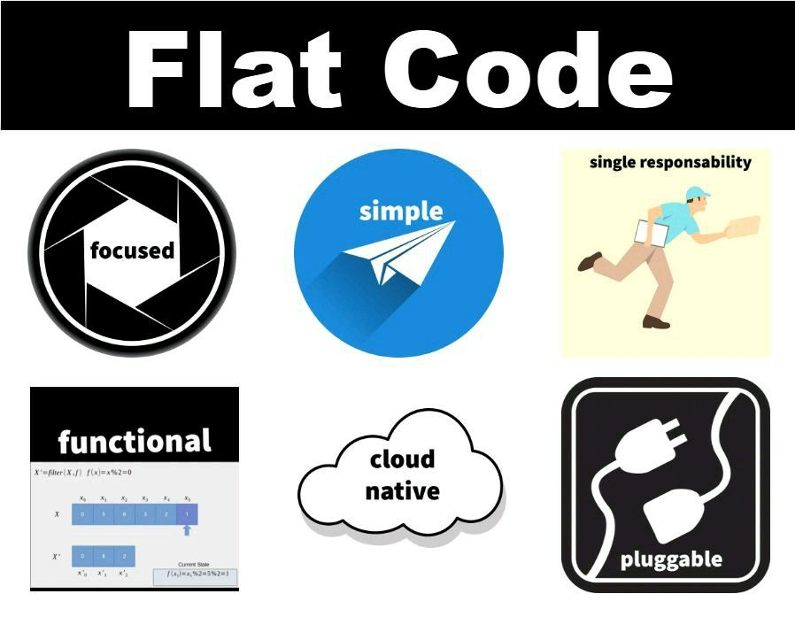
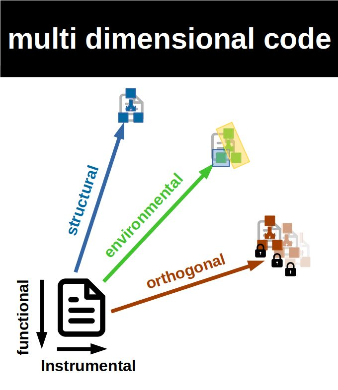
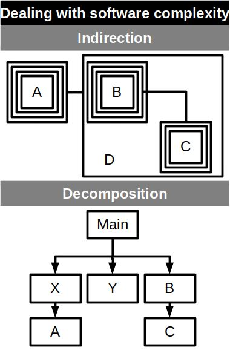
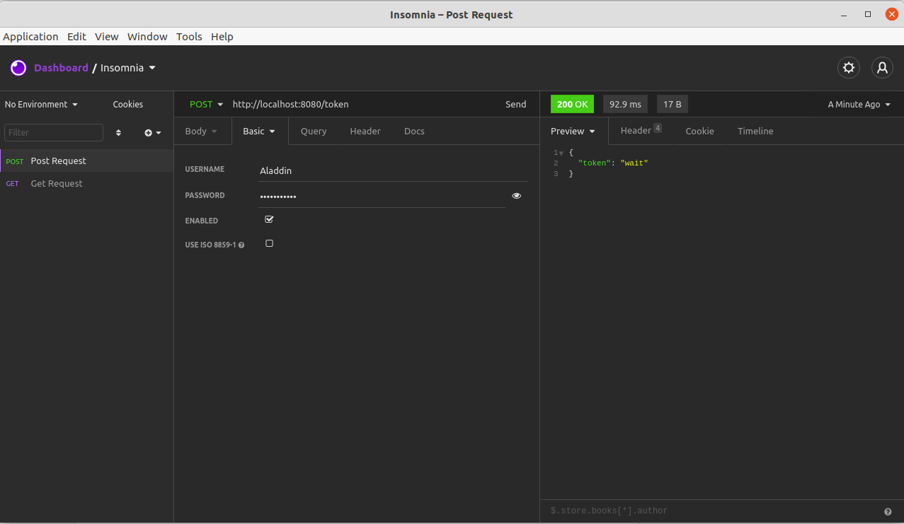
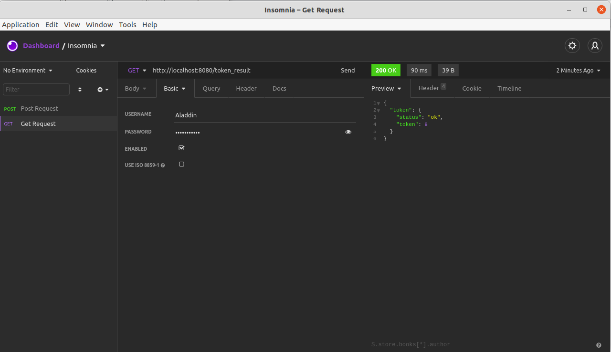

# Flat code: Menos código, mais software

[*Cleuton Sampaio*](https://github.com/cleuton)

<a rel="license" href="http://creativecommons.org/licenses/by/4.0/"></a><br />Este obra está licenciado com uma Licença <a rel="license" href="http://creativecommons.org/licenses/by/4.0/">Creative Commons Atribuição 4.0 Internacional</a>.



Flat Code é uma nova forma de construir software, mais produtiva e objetiva:
- **Focado**: O código-fonte deve se preocupar apenas com a função principal. Aspectos como: Segurança, escalabilidade e alta disponibilidade, devem ser deixados para a Infraestrutura de TI;
- **Simples**: Sem estruturas de classe ou padrões complexos. O ideal é criar o código mais simples possível, afinal ele deve ser descartável e facilmente substituível;
- **Responsabilidade única**: O código deve ter uma e apenas uma função;
- **Funcional**: Deve-se construir o código encadeando funções puras, evitando loops, "ifs" e efeitos colaterais, reduzindo a complexidade do código;
- **Cloud native**: Construa seu código como serviços desacoplados, seguindo os princípios de Função como Serviço, tornando simples servir com mecanismos como nuvens ou containers;
- **Plugável (Pluggable)**: O código deve ter interface simples, reduzida (ISP) e óbvia (POLA), utilizando mecanismos e protocolos padrão para interoperabilidade;

## Qual é o oposto do código simples?

Bem, eu costumo chamá-lo de código **multidimensional** ou **FatCode**.



O código multidimensional é o oposto do flat code, ou seja, existem muito mais dimensões que preocupam o programador, além das 2 obrigatórias, que seriam:
- **Funcional**: O que o código deve fazer;
- **Instrumental**: Os instrumentos (funções e APIs) que a linguagem de programação escolhida fornece.

Essas outras dimensões são:
- **Estrutural**: Os dados complexos e estruturas de classe, loops, "ifs" e padrões de projeto que precisam ser seguidos;
- **Ambiental (environmental)**: As estruturas que o programador deve obedecer, seja por escolha ou impostas pela Empresa;
- **Ortogonal**: Aspectos com os quais o programador precisa se preocupar, tais como: Escalabilidade, Segurança e Alta Disponibilidade, que devem ser deixados para a Infraestrutura de TI.

Flat code é uma diretriz a ser seguida, que torna o código mais simples, aumentando a produtividade do programador e a lucratividade da empresa. Nem sempre podemos eliminar todas as dimensões, mas podemos reduzi-las.

## Diga-me mais...


A ideia de propor o flat code não é substituir ou se opor aos atuais paradigmas de programação, mas oferecer alternativas mais leves para aumentar a produtividade e lucratividade das empresas.
De forma alguma, isso significa que usar outros paradigmas e métodos é ruim ou piora a produtividade.
É apenas uma maneira diferente de abordar o desenvolvimento de software.

Vivemos uma época em que a infraestrutura de TI avançou muito, absorvendo tarefas que antes seriam específicas do desenvolvimento, e nos permitindo reduzir o número de problemas com que temos que nos preocupar na hora de codificar o software.

Ao mesmo tempo, estamos constantemente inflando nosso código-fonte com estruturas e frameworks complexos, cujos benefícios acabam sendo diluídos em um mar de complexidade acidental. Em um mundo onde os métodos ágeis dominam os projetos de software, essa complexidade acaba reduzindo a produtividade e a lucratividade, pois passamos mais tempo fazendo coisas cujos benefícios ainda não podemos contabilizar.

Escrevi um artigo no Hackernoon detalhando esse problema de complexidade acidental, que está relacionado ao efeito YAGNI (You Ain't Gonna Need It): [**Reasons to Flatten your Source Code**](https://hackernoon.com/reasons-to-flatten-your-source-code-nt4033nm)


>As décadas passam, mas ainda escrevemos software da mesma forma que no século XX.
>O nosso software é um grande castelo, formado por várias camadas sobrepostas e misturadas, de forma a facilitar a sua própria manutenção, mas que, de facto, acabam por criar o efeito contrário: um verdadeiro monólito.

## Lidando com a complexidade

Existem basicamente duas maneiras de lidar com a complexidade do software: Indireção, que significa adicionar camadas de abstração, e decomposição, que significa dividir o problema em partes menores. Embora haja pelo menos duas maneiras, tenho a impressão de que a maioria dos desenvolvedores prefere a Indireção como solução. Criando camadas e camadas de abstração, usando ou não padrões de projeto.



## Frameworks: Teias de aranha que unem você, o software e a empresa

Tenho certa aversão por frameworks, acredito que, na maioria dos casos, agregam menos valor do que complexidade acidental ao código. E, para piorar as coisas, muitos frameworks têm um *roadmap* agressivo, com versões destrutivas na maioria dos casos e você é forçado a migrar ou se contentar com uma versão antiga.
E, de qualquer forma, os frameworks são projetadas para enredar seu software em uma teia que é difícil de quebrar. Eu costumo dizer o seguinte:

> Frameworks são soluções que você não precisa, para problemas que você não tem.

A questão é: *Podemos desenvolver software sem usar nenhum framework?*

Devido à diversidade de plataformas e à necessidade de interoperabilidade, provavelmente não. Mas é possível reduzir a dependência desses frameworks, compartimentando o código para evitar sua propagação.

## Aspectos devem ser externalizados

Existem vários aspectos do software que podem e devem ser externalizados hoje em dia. Costumo dizer que são aspectos ortogonais à função do software, pois costumam ser invariantes, ou seja, independentemente da funcionalidade a ser implementada, os aspectos externos ou extrínsecos seguem suas próprias necessidades e padrões.

Gosto de citar como exemplos:
- Segurança: Autenticação e autorização, que hoje em dia dependem mais de mecanismos externos, como LDAP ou SAML, do que da implementação interna no software;
- Escalabilidade: Capacidade de ampliar o uso e a disponibilidade de recursos para atender a crescente demanda de uso de software;
- Alta disponibilidade: Capacidade de continuar trabalhando e atendendo os usuários mesmo em caso de falha do equipamento;

Com modernos recursos de infraestrutura, como: Containers, Orquestradores e servidores FaaS, devemos deixar esses aspectos extrínsecos para a infraestrutura de TI, racionalizando nossos investimentos e despesas.

# Vejo muita conversa fiada e nenhum código


OK. Vamos mostrar um exemplo muito simples, para demonstrar como introduzimos dimensões extras no código-fonte sem real necessidade. Normalmente esse processo começa com a leitura da história do usuário, porque ao invés de pensar em entender o problema para dar uma solução, nós realmente pensamos em como resolver o problema usando nosso "arsenal" de ferramentas preferidas.

Vamos supor que o usuário tenha passado o seguinte relatório para a equipe:

> Precisamos de um módulo que retorne o valor de um parâmetro para o cliente. O número fornecido é o número do termo da progressão dada pela fórmula:
> F1 = 1, F2 = 1
> Fn = Fn-1 + Fn-2
> Dependendo do número passado, o cálculo leva muito tempo e isso não pode acontecer.
> O número do termo é o tamanho dos caracteres do nome do usuário. Para limitar, temos entre 2 e 15 caracteres. Se estiver fora desse intervalo, use o valor 5.
> Um ponto importante é que hoje usamos esta função, mas isso pode mudar no futuro.
> Muitos usuários acessarão este módulo simultaneamente. Ele será integrado ao aplicativo da web existente hoje.

* (Sim ... É o termo função da sequência de Fibonacci, mas vamos ignorá-lo por enquanto. Vamos fingir que é qualquer função) *

** Se você pudesse perguntar algo ao usuário, o que seria? **

Esse requisito fazia parte de uma aula que passei aos meus alunos. Sempre pedi para listar essas questões. Aproveitei para passar este texto a alguns desenvolvedores profissionais e, para minha surpresa, eles fizeram as mesmas perguntas:

- Quais são os requisitos de segurança para acessar esta função?
- Quantos usuários podem acessar isso simultaneamente?
- Podemos implementá-lo como uma solicitação assíncrona?

Depois de apresentar este caso a algumas centenas de pessoas, entre alunos e colegas, apenas alguns fizeram as perguntas realmente relevantes:
- Esta função se parece com uma máquina de estados finitos determinístos, uma vez que sempre retorna o mesmo resultado para a mesma entrada. Podemos substituí-lo por uma tabela de banco de dados ou algo semelhante?
- Qual seria o tempo máximo de resposta tolerável?

Pretendo mostrar como os alunos (e alguns desenvolvedores) implementaram essa história, então irei considerar neste ponto apenas as 3 perguntas mais comuns e possíveis respostas do usuário:

- Quais são os requisitos de segurança para acessar esta função? *Os mesmos do aplicativo web*
- Quantos usuários podem acessar isso simultaneamente? *Possivelmente o mesmo número de usuários que temos hoje: cerca de 2.500*
- Podemos implementá-lo como uma solicitação assíncrona? *Faça o que quiser, apenas preste atenção ao curto prazo que temos*

## Resolvendo a maneira tradicional

Os desenvolvedores se reúnem para discutir a história:

**Dev # 1**:

Não é difícil concluir que essa história seria melhor implementada como um serviço RESTful, pois seria fracamente acoplado e poderia se integrar a qualquer aplicativo que precisasse. Como já estamos usando a linguagem **Python**, usaremos o [framework Flask](https://flask.palletsprojects.com/en/1.1.x/) para implementar este serviço.

**Dev # 2**:

E, como o usuário disse que essa história mudaria no futuro, precisamos garantir a flexibilidade e manutenção do código-fonte, precisamos usar abstrações e padrões de design para atingir esse objetivo.

Por exemplo, podemos usar Strategy (abstrata e concreta) sendo instanciada por um Abstract Factory. Portanto, mesmo que a história mude muito e outros tipos de cálculos sejam necessários, podemos minimizar o impacto no código-fonte.

**Dev # 3**:

Devemos nos lembrar da segurança! Precisamos de alguma forma de controle de acesso... Presumo que o usuário já estará autenticado, mas é necessário verificar isso antes de chamar a função.

**Dev # 4**:

E quanto à escalabilidade e alta disponibilidade? Cada solicitação pode ter um tempo de processamento variável e pode precisar ser executada de forma assíncrona. Podemos dividi-lo em 2 solicitações: uma para solicitar o cálculo e outra para verificar se já foi concluído. E podemos usar algo como um pool de threads para realizar os cálculos.

> Alerta YAGNI: Até agora, apenas as possibilidades futuras foram discutidas, não as necessidades atuais.

Estou exagerando? Essa discussão hipotética entre os desenvolvedores aconteceria? Bem, acompanhei alguns grupos de alunos implementando este exercício e as discussões foram mais ou menos assim.

Você pode ver o exemplo implementado na pasta [**fatcode_sample**](../ fatcode_sample) Agora, vamos dar uma olhada em algumas das soluções adotadas pelos desenvolvedores para resolver o problema levantado na história.

### Dimensão estrutural

Eles implementaram os padrões Abstract Factory e Strategy para abstrair a função de cálculo, permitindo que o mesmo código trabalhe para vários tipos diferentes de funções. Vejamos a pasta [./fatcode_sample/business](../fatcode_sample/business). Na pasta business/factories, eles criaram um Abstract Factory para instanciar a estratégia a ser usada no cálculo:

```
from business.abstract_strategy import AbstractStrategy
from abc import ABC, abstractmethod
class AbstractFactory(ABC):

    @abstractmethod
    def create_calc_strategy(self) -> AbstractStrategy:
        pass
```

Na pasta business está a classe Abstract Strategy usada para realizar o cálculo:

```
from abc import ABC, abstractmethod
class AbstractStrategy(ABC):

    @abstractmethod
    def calculate(self,name):
        pass
```

Na pasta de business/factories/concrete, temos a classe de estratégia concreta:

```
from business.abstract_strategy import AbstractStrategy
from business.token_function import calc_token

class ConcreteStrategy(AbstractStrategy):
    def calculate(self,name):
        if len(name) < 3 or len(name) >15:
            tamanho = 5
        else:
            tamanho  = len(name)
        result = {}
        result['name']=name
        result['token']=calc_token(tamanho)
        return result
```

E esta é a função que realiza o cálculo propriamente dito:

```
def calc_token(n):
	if n<0:
		return -1
	elif n==1:
		return 0
	elif n==2:
		return 1
	else:
		return calc_token(n-1) + calc_token(n-2)
```

Finalmente, podemos ver a classe Factory concreta que instancia a estratégia concreta a ser usada:

```
from business.concrete.concrete_strategy import ConcreteStrategy
from business.factories.abstract_strategy_factory import AbstractFactory
class ConcreteFactory(AbstractFactory):
    def create_calc_strategy(self) -> ConcreteStrategy:
        return ConcreteStrategy()
```

Para simplificar, a decisão de qual Factory utilizar está no código do servidor principal ("servidor.py"), mas pode ser injetada através de algum mecanismo de injeção de dependência:
```
factory = ConcreteFactory()
```

Dessa forma, o código-fonte da camada de negócios não sabe qual estratégia concreta está sendo utilizada, evitando dependências indesejadas. O código da camada de negócios recebe uma instância da fábrica abstrata:

```
def start_calc (factory: AbstractFactory, name, poolx):
    strategy = factory.create_calc_strategy()
    results_group.addResult(name)
    future=poolx.submit(strategy.calculate,name)
    future.add_done_callback(set_result)
    result = {'future':future}
    return "wait"
```

### Dimensão ambiental

Como foi decidido utilizar o framework Flask para criar um serviço RESTful, temos o código do framework intercalado com o código da aplicação dentro do arquivo "servidor.py". Embora seja razoavelmente separado, ainda é uma preocupação para o desenvolvedor.

O código envolvido com a estrutura também toma decisões de negócios e invoca funções específicas.

### dimensão ortogonal

Houve uma grande preocupação aqui. Temos a parte de segurança, que pode ser vista no "servidor.py":

```
@auth.verify_password
def verify_password(username, password):
    if username in users and \
            check_password_hash(users.get(username), password):
        return username


@app.route('/token', methods=['POST'])
@auth.login_required
def ask_token():
    result = {}
    result["token"] = business_layer.start_calc(factory,auth.current_user(),poolx)
    return json.dumps(result)
```

Decidiu-se usar a estrutura flask_httpauth para lidar com o problema de autenticação e autorização do código-fonte. Nesta primeira versão, eles integram os usuários ao aplicativo, mas posteriormente migrarão para o mesmo banco de dados que controla a segurança do aplicativo web. Eles receberão um HTTP Header de autorização para o aplicativo que contém o usuário atualmente conectado. 

Outro aspecto preocupante foi a escalabilidade. Como o cálculo pode demorar muito, eles decidiram implementar um pool de threads para lidar com os cálculos. Isso pode ser visto em "server.py" e em "business_layer.py":

```
poolx = concurrent.futures.ThreadPoolExecutor(max_workers=config.get('max_threads'))
```

```
class Results:
    results={}
    def __init__(self):
        self.lock = threading.Lock()
    def addResult(self,name):
        with self.lock:
            self.results[name]={}
            self.results[name]['token']=-1
    def updateResult(self,name,token):
        with self.lock:
            self.results[name]['token']=token

    def removeResult(self,name):
        with self.lock:
            del self.results[name]

results_group = Results()

def set_result(future):
    global results
    result = future.result()
    results_group.updateResult(result['name'],result['token'])
    

def start_calc (factory: AbstractFactory, name, poolx):
    strategy = factory.create_calc_strategy()
    results_group.addResult(name)
    future=poolx.submit(strategy.calculate,name)
    future.add_done_callback(set_result)
    result = {'future':future}
    return "wait"

def return_token(name):
    global results
    r = {}
    r['status']='wait...'
    if name in results_group.results.keys():
        token = results_group.results[name]['token']
        if token>0:
            r['status']='ok'
            r['token']=results_group.results[name]['token']
            results_group.removeResult(name)

    return r
```

### Dimensões funcionais e instrumentais

Essas são as dimensões que realmente deveriam preocupar os desenvolvedores. Mas eles escreveram um código simples, baseado em recursão, para realizar o cálculo. Este cálculo é executado pelos trabalhadores no pool de threads:

```
def calc_token(n):
	if n<0:
		return -1
	elif n==1:
		return 0
	elif n==2:
		return 1
	else:
		return calc_token(n-1) + calc_token(n-2)
```

### Resultados

Devido à sua complexidade, o código foi testado manualmente, usando o Insomnia (com autenticação configurada). Aqui, vemos uma solicitação POST para solicitar o token:



And here we see a GET request to get results:



O que podemos falar sobre este código? Ele usa padrões de design, abstrações e mecanismos de segurança e escalabilidade para lidar com problemas. Você faria diferente? Você acha que os desenvolvedores fariam isso de outra maneira? Bom, esse código é muito parecido com o resultado de um dos grupos de alunos e, depois de discutir com meus colegas, vi que eles aprovaram com pouca ou nenhuma alteração.

A maior falha para mim é não ter código de teste automatizado, seja testes de unidade ou testes de integração. No mais, o código está ok e atende ao que foi solicitado.

## Agora, mostre sua magia


Vamos começar com as respostas às duas perguntas que poucos desenvolvedores fizeram:

- Esta função se parece com uma máquina de estados finitos determinísticos, uma vez que sempre retorna o mesmo resultado para a mesma entrada. Podemos substituí-lo por uma tabela de banco de dados ou algo semelhante?
- Qual seria o tempo máximo de resposta tolerável?

A primeira (e mais óbvia) pergunta faz todo o sentido e pode simplificar muito a tarefa. Se o cálculo possui estados finitos e determinísticos, ou seja, dados os mesmos inputs, retornaremos o mesmo output, e considerando que o intervalo de números possíveis é reduzido (2 a 15), não faria mais sentido colocar isso no armazenamento físico?

Vamos supor que o usuário respondeu que esse cálculo mudaria no futuro e o usuário não deseja colocá-lo em um arquivo de disco.

E a segunda pergunta faz tanto sentido quanto a primeira. Qual é o tempo de resposta máximo tolerável? Sem saber disso, como podemos pensar em escalabilidade? Ele respondeu que deveria levar menos de 1 segundo.

Ok, fiz uma primeira versão do código que está na pasta "flatcode_sample" existe uma subpasta "lib" contendo o código de cálculo usando programação funcional:

```
def execute(x):
    fibonacci = (lambda x, x_1=1, x_2=0:
         x_2 if x == 0
         else fibonacci(x - 1, x_1 + x_2, x_1))
    return fibonacci(x)
```

Como os franceses gostam de dizer: "c'est fini"! Criei um caso de teste com todos os valores possíveis e ainda anotei o tempo de execução em segundos:

```
from lib import calc_lib

def seqTest():
    retVal = []
    for n in range(2,16):
        x = calc_lib.execute(n)
        retVal.append(x)
    return retVal
```

```
from tests import test1
import time
#2,3,4,5,6,7,8,9,10,11,12,13,14,15
ret=[1,2,3,5,8,13,21,34,55,89,144,233,377,610]
a = time.time_ns()
retVal = test1.seqTest()
b = time.time_ns()
c = b - a
print(c)
print("Time diff seconds: {}".format(c/1000000000))
mensagem = "Should return:" + str(ret) + " but returned: " + str(retVal)
assert retVal==ret, mensagemfrom tests import test1
import time
#2,3,4,5,6,7,8,9,10,11,12,13,14,15
ret=[1,2,3,5,8,13,21,34,55,89,144,233,377,610]
a = time.time_ns()
retVal = test1.seqTest()
b = time.time_ns()
c = b - a
print(c)
print("Time diff seconds: {}".format(c/1000000000))
mensagem = "Should return:" + str(ret) + " but returned: " + str(retVal)
assert retVal==ret, mensagem
```

Mas o trabalho está feito? Como o usuário executará este código? Para começar, ele disse que seria invocado a partir de um aplicativo da Web, portanto, esse código poderia ser invocado diretamente por esse aplicativo. E, quanto ao tempo de execução, para os parâmetros atuais, é irrelevante.

### Mas você não está garantindo flexibilidade, segurança e escalabilidade, como a outra equipe de desenvolvedores fez


Ok, é justo. Vamos supor que, em alguns casos, o cálculo leve mais de 1 segundo. Como podemos garantir a segurança e escalabilidade do aplicativo?

Se a solicitação pode demorar mais do que o tempo estipulado (1 segundo) e o usuário aceita chamadas assíncronas, a melhor solução seria usar uma fila de mensagens, como RabbitMQ ou ActiveMQ.

É muito fácil "encapsular" o código de nosso cálculo em um listener de fila de mensagens, como neste exemplo do RabbitMQ:

```
#!/usr/bin/env python
import pika, sys, os

def main():
    connection = pika.BlockingConnection(pika.ConnectionParameters(host='localhost'))
    channel = connection.channel()

    channel.queue_declare(queue='hello')

    def callback(ch, method, properties, body):
        # Call the function here!!!!
        print(" [x] Received %r" % body)

    channel.basic_consume(queue='hello', on_message_callback=callback, auto_ack=True)

    print(' [*] Waiting for messages. To exit press CTRL+C')
    channel.start_consuming()

if __name__ == '__main__':
    try:
        main()
    except KeyboardInterrupt:
        print('Interrupted')
        try:
            sys.exit(0)
        except SystemExit:
            os._exit(0)
```

Em vez de invocar um serviço RESTful, o código do aplicativo cliente simplesmente colocaria uma mensagem em uma fila e ouviria outra.

Assim, a questão da escalabilidade está resolvida. E sobre segurança, RabbitMQ suporta outros mecanismos de autorização, como: LDAP ou HTTP. Simplesmente, tudo isso pode ser deixado para Devops para implementação por meio da infraestrutura de TI.

# Conclusão

Esse caso veio de uma aula que passei para meus alunos, mas aconteceu e continua acontecendo na vida real, pois ao invés de ouvir os clientes e tentar resolver seus problemas, acabamos criando soluções que atendem melhor aos nossos próprios problemas.

Abstrações, padrões de projeto e frameworks podem ser bastante úteis, mas sempre aumentam a complexidade acidental da solução, e nem sempre são necessários na vida real (YAGNI). Lembro-me de um caso extremamente complexo, para o qual várias camadas de abstração foram criadas, mas depois de 10 anos, nada mudou realmente, e o aplicativo ainda está funcionando e nunca foi necessário usar todas essas abstrações para criar novos elementos. A questão é: tinha que ser tão complexo?