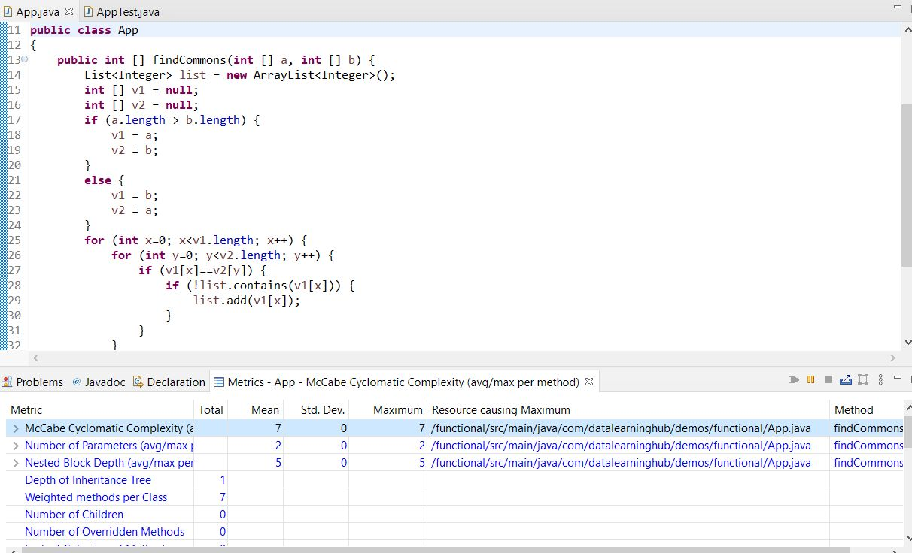

# Functional programming: Why should you care?

[*Cleuton Sampaio*](https://github.com/cleuton)

<a rel="license" href="http://creativecommons.org/licenses/by/4.0/"></a><br />Este obra está licenciado com uma Licença <a rel="license" href="http://creativecommons.org/licenses/by/4.0/">Creative Commons Atribuição 4.0 Internacional</a>.


> “Simplicity is a great virtue but it requires hard work to achieve it and education to appreciate it. And to make matters worse: complexity sells better.” ― Edsger Wybe Dijkstra

You are being interviewed for a job and they asked you to write a code that finds the intersection between two integer vectors, with the limitation of not repeating the common numbers. And they said that you could assume nothing about the classification, uniqueness and size of the vectors. And you created this code:

```
public class App 
{
	public int [] findCommons(int [] a, int [] b) {
		List<Integer> list = new ArrayList<Integer>();
		int [] v1 = null;
		int [] v2 = null;
		if (a.length > b.length) {
			v1 = a;
			v2 = b;
		}
		else {
			v1 = b;
			v2 = a;
		}
		for (int x=0; x<v1.length; x++) {

			for (int y=0; y<v2.length; y++) {
				if (v1[x]==v2[y]) {
					if (!list.contains(v1[x])) {
						list.add(v1[x]);
					}
				}
			}
		}
		int [] returnArray = new int[list.size()];
		for (int i=0; i<list.size(); i++) {
			returnArray[i] = list.get(i);
		}
		return returnArray;
	}
}
```

The given test code is:

```
   @Test
    public void shouldAnswerWithTrue()
    {
    	 int [] a = {4,7,8,10,11,12,20,25};
    	 int [] b = {1,5,7,7,13,2,9,8,30,35,20,15};
    	 int [] commons = {7,8,20};
    	 App app = new App();
    	 int [] returnArray = app.findCommons(a,b);
    	 Arrays.sort(returnArray);
    	 assertTrue(Arrays.equals(returnArray, commons));
    }
```

Your code passed the test, returning: [7,8,20].
And they asked you, "Can this code be improved?"
Complexity

No doubt your code works! As a first approach, in a Test driven development process, it looks great. But what about complexity? Let's start with Cyclomatic Complexity: 7



And about the algorithm complexity? We can say that it would be O(R (n, m), where R(n, m) = C(n * m). The complexity would be the product of the quantities of elements in each vector.
I consider a method having cyclomatic complexity greater than 5 as a complex method.
Do I need to talk about the problems of highly complex code?

## Imperative approach

Imperative programming is the traditional way we program, that is, the way the code in the example was created. According to Wikipedia:

> In computer science, imperative programming is a programming paradigm that uses statements that change a program's state. In much the same way that the imperative mood in natural languages expresses commands, an imperative program consists of commands for the computer to perform. Imperative programming focuses on describing how a program operates. (Wikipedia)

As you can see, in imperative programming, you tell how the result should be calculated and we modify the state of the code with these commands.
When we work on changing the state at all times, we run a greater risk of changes to the source code, which can have side effects:

> In computer science, an operation, function or expression is said to have a side effect if it modifies some state variable value(s) outside its local environment, that is to say has an observable effect besides returning a value (the main effect) to the invoker of the operation. State data updated "outside" of the operation may be maintained "inside" a stateful object or a wider stateful system within which the operation is performed. Example side effects include modifying a non-local variable, modifying a static local variable, modifying a mutable argument passed by reference, performing I/O or calling other side-effect functions. (Wikipedia)

And we have some examples of side effects in the code, one of which would be updating the list inside the loop. This increases the risk that maintenance will lead to errors.

## Functional programming will rescue you

The core of functional programming is to solve the problem by applying function compositions, without intermediate variables whenever possible. We avoid loops, which increase the cyclomatic complexity of the code, and side effects in the code. The function only returns its own result, without affecting other variables.
In computer science, functional programming is a programming paradigm where programs are constructed by applying and composing functions. It is a declarative programming paradigm in which function definitions are trees of expressions that map values to other values, rather than a sequence of imperative statements which update the running state of the program. (Wikipedia)
In functional programming, the functions are first-class citizens, and they can assume names, be associated with variables or arguments and or return from other functions.
It is not just a matter of creating lambda expressions, but of transforming vectors into data streams and operating on them, chaining filters, functions and mapping the results to the type of collection we want.
Let's try a first approach to simplify and optimize the code in the initial example:
```
import java.util.Set;
import java.util.stream.Collectors;
import java.util.stream.IntStream;

public class AppFunctional {
	public int [] findCommons(int [] a, int [] b) {
	    Set<Integer> setA = IntStream.of(a).boxed().collect(Collectors.toSet());
	    Set<Integer> setB = IntStream.of(b).boxed().collect(Collectors.toSet());
	    setB.retainAll(setA);
	    return setB.stream().mapToInt(i -> i).toArray();
	}
}
```


Hummmm ... But you are still generating side effects, as there is a variable (setB) being changed outside the function.
In fact, you are right. The expression: "setB.retainAll (setA)" is changing an external variable. This "retainAll ()" function is not a Pure Function:

```
In computer programming, a pure function is a function that has the following properties:
    1. The function return values are identical for identical arguments (no variation with local static variables, non-local variables, mutable reference arguments or input streams).
    2. The function application has no side effects (no mutation of local static variables, non-local variables, mutable reference arguments or input/output streams).
(Wikipedia)
```

When transforming the vectors into Sets, we automatically eliminate duplicates. We use the new class "IntStream" to generate a stream of primitive values "int", on it, we invoke the "boxed ()" method to encapsulate the primitives in instances of "Integer", in order to generate a "Set" through the "collect ()" and using the "Collector toSet". Collect will make a mutable reduction in the object, transforming it element by element.

This is a terminal operation, meaning it must be the last in an expression that uses Streams in Java.
Although we have reduced the complexity of the code, we still have side effects. We need to use Pure Functions and to return references to the object they have changed.
In this second example, the "retainAll ()" function returns a boolean value, indicating whether the "set" has been changed by the command. A function that changes a past argument is the worst situation that can happen! This totally violates the concept of a "function".

## Purely functional code

The second version of the code is perfectly fine, with low complexity and very simple to understand. We changed 25 lines for just 4. And we eliminated 3 loops and 3 "ifs".
But, if we want, we can further improve the code, making it more purely functional. To begin with, we need a way to filter a stream ... What's a stream, anyway?
- **Stream**: A class that operates on a sequence of elements, which can come from elementary types, collections, or even functions that we create.
- **Pipeline**: A chain of functions, which starts at a stream source, one or more intermediate functions and a terminal function.
- **Transformations**: Functions like "sorted ()", "distinct ()" and "filter ()" operate on streams and are intermediate, as they allow us to chain more operations. "map ()" is a special operation that transforms the nature of the stream, for example, converting each element from one type to another (mapToInt () converts to primitive types "int").
- **Terminal operations**: Functions that complete a pipeline. After these functions, the stream is considered as "consumed" and can no longer be used. Examples: "forEach ()" and "collect ()".
So, let's go to the final version of our code:

```
import java.util.Set;
import java.util.stream.Collectors;
import java.util.stream.IntStream;

public class AppMoreFunctional {
	public int [] findCommons(int [] a, int [] b) {
 		return IntStream.of(b).boxed().collect(Collectors.toSet())
 				.stream()
 				.filter(IntStream.of(a).boxed().collect(Collectors.toSet())::contains)
 				.mapToInt(i -> i).toArray();
	}
}
```


## That's it! Only one statement!

Ok ... it looks weird and more difficult to understand than the first version, full of loops. But you need to open your mind to new possibilities and start thinking about function pipelines, instead of loops and "ifs".
But let's look at the expression calmly and you will see that it is quite simple:
1. We transformed the vector from "int" into a "set", just as we did in the second example:
IntStream.of (b) .boxed (). Collect (Collectors.toSet ())

2. We eliminate duplication, then we generate a stream with the elements of this "set":
.stream () 

3. We filter the elements of the "set" that are contained in the other set. We will explain the transformation in the next step:
.filter(...)

4. We transform the other vector into a "set", eliminating duplicates with "collect ()", and operate on this "set" with the "contains ()" method. The double colon syntax means a reference to the method of the "set" class:
IntStream.of (a) .boxed (). Collect (Collectors.toSet ()) :: contains

We are filtering out the elements of "b" that are contained in "a".

5) We need to return an "int" vector, but we have a "stream" of objects. We need to use the "mapToInt ()" method by passing a simple lambda function, which only returns what it received, turning the Integers into Ints, and ending with the transformation into an array:
```
.mapToInt (i -> i) .toArray () 
```

I will not lie to you ... It is not simple to change the way we reason from Imperative to Functional. This change requires changing the way we program, moving up a level in the abstraction of the problem in question.

## Conclusion (or why should you care?)

This little story about the job interview happened to me. The problem was not exactly like this, but it was very similar. The first version I made was very simple and lacked optimization. So, the interviewer asked this same question: "Can this code be improved?"

Has the code been improved? I reduced the complexity and avoided side effects, in addition to decreasing from 25 to 4 lines and just 1 statement. With that, I increased the maintainability and flexibility of the source code. Isn't that an improvement?

But what about performance? Some opponents of functional programming claim that these expressions are slower and that the imperative code can be better optimized for faster processing. Well, that could be true at the beginning of functional programming, but now? Certainly compilers have evolved to optimize functional as well as imperative expressions.

And, moreover, if you want performance, better to use a native programming language like: C ++.

Cleuton Sampaio, M.Sc.
