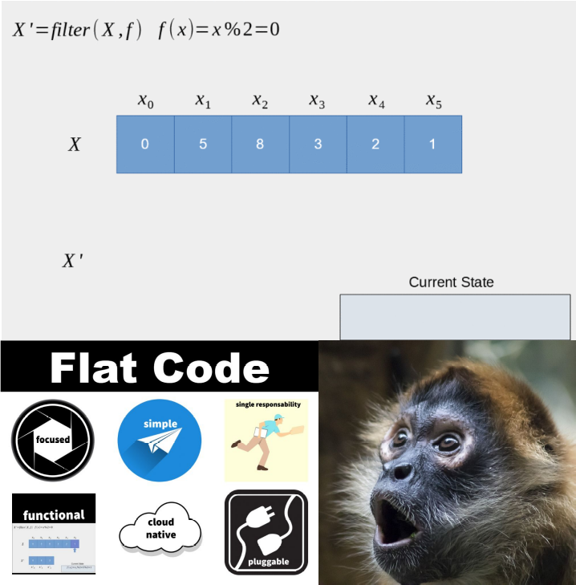
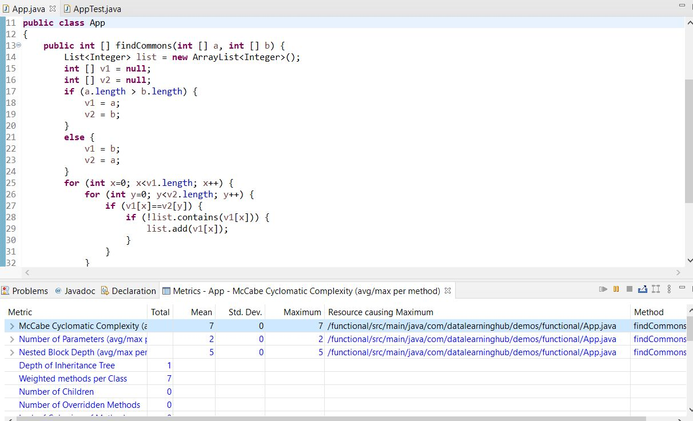

# Programação funcional: Por que você deveria se importar?

[*Cleuton Sampaio*](https://github.com/cleuton)

<a rel="license" href="http://creativecommons.org/licenses/by/4.0/"></a><br />Este obra está licenciado com uma Licença <a rel="license" href="http://creativecommons.org/licenses/by/4.0/">Creative Commons Atribuição 4.0 Internacional</a>.




> “Simplicidade é uma grande virtude, mas requer muito trabalho para alcançá-la e educação para apreciá-la. E para piorar as coisas: a complexidade vende melhor.” ― Edsger Wybe Dijkstra

Você está sendo entrevistado para um emprego e eles pediram que você escrevesse um código que encontrasse a interseção entre dois vetores inteiros, com a limitação de não repetir os números comuns. E eles disseram que você não poderia assumir nada sobre a classificação, exclusividade e tamanho dos vetores. E você criou este código:

```
public class App 
{
	public int [] findCommons(int [] a, int [] b) {
		List<Integer> list = new ArrayList<Integer>();
		int [] v1 = null;
		int [] v2 = null;
		if (a.length > b.length) {
			v1 = a;
			v2 = b;
		}
		else {
			v1 = b;
			v2 = a;
		}
		for (int x=0; x<v1.length; x++) {

			for (int y=0; y<v2.length; y++) {
				if (v1[x]==v2[y]) {
					if (!list.contains(v1[x])) {
						list.add(v1[x]);
					}
				}
			}
		}
		int [] returnArray = new int[list.size()];
		for (int i=0; i<list.size(); i++) {
			returnArray[i] = list.get(i);
		}
		return returnArray;
	}
}
```

E lhe deram um código de teste: 

```
   @Test
    public void shouldAnswerWithTrue()
    {
    	 int [] a = {4,7,8,10,11,12,20,25};
    	 int [] b = {1,5,7,7,13,2,9,8,30,35,20,15};
    	 int [] commons = {7,8,20};
    	 App app = new App();
    	 int [] returnArray = app.findCommons(a,b);
    	 Arrays.sort(returnArray);
    	 assertTrue(Arrays.equals(returnArray, commons));
    }
```

Seu código passou no teste, retornando: [7,8,20].
E eles lhe perguntaram: "Este código pode ser melhorado?"


## Complexidade

Sem dúvida, seu código funciona! Como primeira abordagem, em um processo de desenvolvimento orientado por teste, parece ótimo. Mas e quanto à complexidade? Vamos começar com a Complexidade Ciclomática: 7



E sobre a complexidade do algoritmo? Podemos dizer que seria O (R (n, m), onde R (n, m) = C (n * m). A complexidade seria o produto das quantidades de elementos em cada vetor.
Eu considero um método com complexidade ciclomática maior que 5 como um método complexo.
Preciso falar sobre os problemas de código altamente complexo?

## Abordagem imperativa

A programação imperativa é a forma tradicional que programamos, ou seja, a forma como o código do exemplo foi criado. De acordo com a Wikipedia:

> Na ciência da computação, a programação imperativa é um paradigma de programação que usa instruções que alteram o estado de um programa. Da mesma forma que o modo imperativo em linguagens naturais expressa comandos, um programa imperativo consiste em comandos para serem executados pelo computador. A programação imperativa se concentra em descrever como um programa opera. (Wikipedia)

Como você pode ver, na programação imperativa, você diz como o resultado deve ser calculado e nós modificamos o estado do código com esses comandos.
Quando trabalhamos para alterar o estado o tempo todo, corremos um risco maior de alterações no código-fonte, o que pode ter efeitos colaterais:

> Em ciência da computação, uma operação, função ou expressão tem um efeito colateral se modificar algum valor (es) de variável de estado fora de seu ambiente local, ou seja, tem um efeito observável além de retornar um valor (o efeito principal) para o invocador da operação. Os dados de estado atualizados "fora" da operação podem ser mantidos "dentro" de um objeto com estado ou de um sistema com estado mais amplo dentro do qual a operação é executada. Os exemplos de efeitos colaterais incluem a modificação de uma variável não local, a modificação de uma variável local estática, a modificação de um argumento mutável passado por referência, a execução de E / S ou a chamada de outras funções de efeito colateral. (Wikipedia)

E temos alguns exemplos de efeitos colaterais no código, um dos quais seria atualizar a lista dentro do loop. Isso aumenta o risco de que a manutenção leve a erros.

## A programação funcional vem ao seu resgate

O núcleo da programação funcional é resolver o problema aplicando composições de funções, sem variáveis ​​intermediárias sempre que possível. Evitamos loops, que aumentam a complexidade ciclomática do código, e efeitos colaterais no código. A função retorna apenas seu próprio resultado, sem afetar outras variáveis.
Na ciência da computação, a programação funcional é um paradigma de programação onde os programas são construídos aplicando e compondo funções. É um paradigma de programação declarativo no qual as definições de função são árvores de expressões que mapeiam valores para outros valores, em vez de uma sequência de instruções imperativas que atualizam o estado de execução do programa. (Wikipedia)
Na programação funcional, as funções são cidadãs de primeira classe, e podem assumir nomes, ser associadas a variáveis ​​ou argumentos e / ou retornar de outras funções.
Não se trata apenas de criar expressões lambda, mas de transformar vetores em fluxos de dados e operá-los, encadeando filtros, funções e mapeando os resultados para o tipo de coleção que desejamos.
Vamos tentar uma primeira abordagem para simplificar e otimizar o código no exemplo inicial:

```
import java.util.Set;
import java.util.stream.Collectors;
import java.util.stream.IntStream;

public class AppFunctional {
	public int [] findCommons(int [] a, int [] b) {
	    Set<Integer> setA = IntStream.of(a).boxed().collect(Collectors.toSet());
	    Set<Integer> setB = IntStream.of(b).boxed().collect(Collectors.toSet());
	    setB.retainAll(setA);
	    return setB.stream().mapToInt(i -> i).toArray();
	}
}
```


Hummmm ... Mas você ainda está gerando efeitos colaterais, pois há uma variável (setB) sendo alterada fora da função.
Na verdade, você está certo. A expressão: "setB.retainAll(setA)" está mudando uma variável externa. Esta função "retémAll()" não é uma função pura:

> Na programação de computadores, uma função pura é uma função que possui as seguintes propriedades:
> 1. Os valores de retorno da função são idênticos para argumentos idênticos (sem variação com variáveis locais estáticas, variáveis não locais, argumentos de referência mutáveis ou fluxos de entrada).
> 2. O aplicativo de função não tem efeitos colaterais (nenhuma mutação de variáveis estáticas locais, variáveis não locais, argumentos de referência mutáveis ou fluxos de entrada / saída).
> (Wikipedia)

Ao transformar os vetores em Conjuntos, eliminamos automaticamente as duplicatas. Usamos a nova classe "IntStream" para gerar um fluxo de valores primitivos "int", nela invocamos o método "boxed()" para encapsular os primitivos em instâncias de "Integer", a fim de gerar um "Conjunto" através do "collect()" e usando o "Collector toSet". Collect fará uma redução mutável no objeto, transformando-o elemento por elemento.

Esta é uma operação de terminal, o que significa que deve ser a última em uma expressão que usa Streams em Java.
Embora tenhamos reduzido a complexidade do código, ainda temos efeitos colaterais. Precisamos usar funções puras e retornar referências ao objeto alterado.
Neste segundo exemplo, a função "retémAll()" retorna um valor booleano, indicando se o "conjunto" foi alterado pelo comando. Uma função que muda um argumento passado é a pior situação que pode acontecer! Isso viola totalmente o conceito de "função".

## Código puramente funcional

A segunda versão do código é perfeitamente adequada, com baixa complexidade e muito simples de entender. Mudamos 25 linhas por apenas 4. E eliminamos 3 loops e 3 "ifs".
Mas, se quisermos, podemos melhorar ainda mais o código, tornando-o mais puramente funcional. Para começar, precisamos de uma maneira de filtrar um fluxo ... Afinal, o que é um fluxo?
- **Stream**: Uma classe que opera em uma sequência de elementos, que podem vir de tipos elementares, coleções ou mesmo funções que criamos.
- **Pipeline**: uma cadeia de funções, que começa em uma fonte de fluxo, uma ou mais funções intermediárias e uma função terminal.
- **Transformações**: funções como "ordenadas ()", "distintas ()" e "filtro ()" operam em fluxos e são intermediárias, pois permitem encadear mais operações. "map ()" é uma operação especial que transforma a natureza do fluxo, por exemplo, convertendo cada elemento de um tipo para outro (mapToInt () converte em tipos primitivos "int").
- **Operações de terminal**: funções que completam um pipeline. Após essas funções, o stream é considerado "consumido" e não pode mais ser utilizado. Exemplos: "forEach ()" e "collect ()".
Então, vamos para a versão final do nosso código:

```
import java.util.Set;
import java.util.stream.Collectors;
import java.util.stream.IntStream;

public class AppMoreFunctional {
	public int [] findCommons(int [] a, int [] b) {
 		return IntStream.of(b).boxed().collect(Collectors.toSet())
 				.stream()
 				.filter(IntStream.of(a).boxed().collect(Collectors.toSet())::contains)
 				.mapToInt(i -> i).toArray();
	}
}
```


## É isso aí! Um só comando!

Ok ... parece estranho e mais difícil de entender do que a primeira versão, cheia de loops. Mas você precisa abrir sua mente para novas possibilidades e começar a pensar em pipelines de funções, em vez de loops e "ifs".
Mas olhemos para a expressão com calma e você verá que é bastante simples:
1. Transformamos o vetor de "int" em um "conjunto", assim como fizemos no segundo exemplo:
```
IntStream.of (b).boxed().Coletar(Collectors.toSet())
```

2. Eliminamos a duplicação e, em seguida, geramos um fluxo com os elementos deste "conjunto":
```.stream()```

3. Filtramos os elementos do "conjunto" que estão contidos no outro conjunto. Explicaremos a transformação na próxima etapa:
```.filter(...)```

4. Transformamos o outro vetor em um "conjunto", eliminando duplicatas com "collect ()", e operamos neste "conjunto" com o método "contains ()". A sintaxe de dois pontos duplos significa uma referência ao método da classe "set":
```
IntStream.of(a).boxed().Collect(Collectors.toSet())::contém
```

Estamos filtrando os elementos de "b" contidos em "a".

5) Precisamos retornar um vetor "int", mas temos um "fluxo" de objetos. Precisamos usar o método "mapToInt ()" passando uma função lambda simples, que retorna apenas o que recebeu, transformando os inteiros em Ints e terminando com a transformação em uma matriz:
```
.mapToInt(i -> i).toArray()
```

Não vou mentir para você ... Não é simples mudar a maneira como raciocinamos de Imperativo para Funcional. Essa mudança requer mudar a maneira como programamos, subindo um nível na abstração do problema em questão.

## Conclusão (ou por que você deveria se importar?)

Esta pequena história sobre a entrevista de emprego aconteceu comigo. O problema não era exatamente assim, mas era muito parecido. A primeira versão que fiz era muito simples e não tinha otimização. Então, o entrevistador fez a mesma pergunta: "Esse código pode ser melhorado?"

O código foi melhorado? Reduzi a complexidade e evitei efeitos colaterais, além de diminuir de 25 para 4 linhas e apenas 1 declaração. Com isso, aumentei a capacidade de manutenção e flexibilidade do código-fonte. Isso não é uma melhoria?

Mas e quanto ao desempenho? Alguns oponentes da programação funcional afirmam que essas expressões são mais lentas e que o código imperativo pode ser melhor otimizado para processamento mais rápido. Bem, isso poderia ser verdade no início da programação funcional, mas agora? Certamente, os compiladores evoluíram para otimizar expressões funcionais e imperativas.

E, além disso, se você quer performance, é melhor usar uma linguagem de programação nativa como: C ++.

Cleuton Sampaio, M.Sc.
