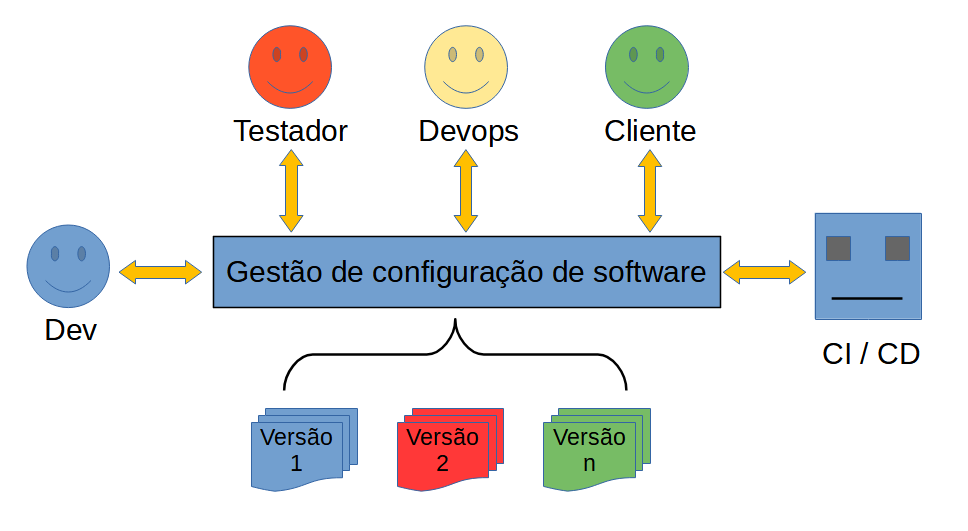

# Gestão de configuração de software sem traumas

***Cleuton Sampaio**, M.Sc*
- [**LinkedIn**](https://www.linkedin.com/in/cleutonsampaio), [**github**](https://github.com/cleuton) 

## Sumário:

1. [As dores do parto do software](./capt1/README.md);
2. [Tarefas básicas de versionamento](./capt2/README.md);
3. [Merge com dor](./capt3/README.md);
4. [Gestão suave na nave de mudanças](./capt4/README.md);
5. [Tópicos avançados (nem tanto)](./capt5/README.md);

## Licença do material

https://creativecommons.org/licenses/by/4.0/legalcode.pt

 Este obra está licenciado com uma Licença <a rel="license" href="http://creativecommons.org/licenses/by/4.0/">Creative Commons Atribuição 4.0 Internacional</a>.

## Introdução

[**Gestão de configuração de software**](https://pt.wikipedia.org/wiki/Ger%C3%AAncia_de_configura%C3%A7%C3%A3o_de_software) é uma das disciplinas da [**Engenharia de software**](https://pt.wikipedia.org/wiki/Engenharia_de_software) que cuida da manutenção e versionamento dos componentes de um projeto de software. Segundo a Wikipedia: 

> "Gerência de configuração de software, gerência de configuração ou ainda gestão de configuração de software é uma área da engenharia  de software responsável por fornecer o apoio para o desenvolvimento de software. Suas principais atribuições são o controle de versão, o controle de mudança e a auditoria das configurações."

É uma disciplina essencial em projetos de qualquer tamanho ou quantidade de pessoas e, pasmem, frequentemente mal compreendida ou mal praticada. Vejam esse [gif animado](http://gph.is/2nRsBYP): 

Infelizmente, a GCS (Gestão de Configuração de Software) vem sendo mal empregada. Ou não sabem como fazer, ou confundem os objetivos, enfim, os problemas se acumulam. 

As próprias ferramentas mais populares são muito rudimentares. Vejamos o [**Git**](https://git-scm.com/), por exemplo, você o considera uma boa ferramenta? Eu não. Comparado com outras ferramentas de Controle de Versão (Version Control), como o [**Subversion**](https://subversion.apache.org/), ou o [**Rational Team Concert**](https://jazz.net/products/rational-team-concert.), o **Git** é tosco, para dizer o mínimo. Mas essa é uma opinião pessoal minha, que, embora compartilhada por muitos desenvolvedores, não é consenso. 

Neste trabalho eu estou usando o **Git**, não por considerá-lo adequado, mas pela sua popularidade, especialmente associada às ferramentas complementares, como o [**GitLab**](https://about.gitlab.com/). 

Este trabalho é para todos aqueles que desenvolvem software em equipe e querem investir em **GCS** para melhorar a estabilidade, qualidade e diminuir o prazo de entregas do seu software. 