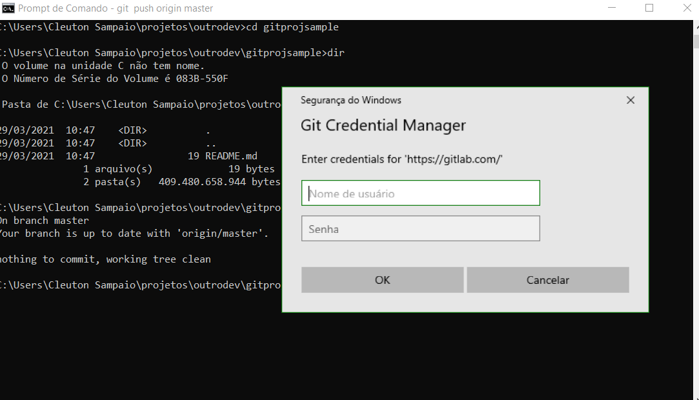

# Tarefas básicas de versionamento

Ok, você já conhece **Git**... certo... Se eu fosse você, continuaria a ler, mesmo bocejando.

Eu criei um repositório beeeem simples para demonstrar tudo o que acontece aqui. Ele está na versão final, pois eu já rodei muita coisa, mas os arquivos originais do projeto exemplo estão [**nesta pasta**](./projeto). Crie um repositório com estes arquivos, no Github, no Gitlab ou use uma [imagem **Docker** do gitlab](https://hub.docker.com/_/gitlab-community-edition) só para poder usar um repositório remoto.

Crie um repositório **Git** remoto, o que pode ser no **Github**, **Gitlab** ou em um **Gitlab docker**. Crie o repositório e depois faça um clone local dele. 

Vou mostrar como fazer isso no site do [**Gitlab**](https://gitlab.com/), pois muitas empresas usam Gitlab local para armazenar as versões dos projetos. 

## Git local

Geralmente, trabalhamos com um **Git** local em nossa máquina, sincronizando mudanças com um **Git** remoto da nossa equipe. Esse **Git** remoto pode estar rodando em um **Gitlab** ou ser o próprio **Github**. 

Primeiro, veremos como trabalhamos com o **Git** local. 

Eu realmente detesto **Git**. Para mim, é como uma doença autoimune: Você tem que conviver com ele. Ele é um sistema de controle de versões individual, que pode se relacionar com outros repositórios git remotamente. 

Existem várias ferramentas GUI e IDEs que conseguem interagir com **Git**, mas o meio preferencial de lidar com ele é através do comando **git**. Verifique se você tem instalado em sua máquina. Abra um **Terminal** ou **Prompt de Comando** e digite: 

```
git --version
```

Como funciona o **Git**?

Vamos criar um repositório e entender os estados dos arquivos com relação ao Git. Depois de instalar o Git (linha de comando), siga estes passos: 

```
C:\Users\Cleuton Sampaio\projetos>mkdir testegit

C:\Users\Cleuton Sampaio\projetos>cd testegit

C:\Users\Cleuton Sampaio\projetos\testegit>git init
Initialized empty Git repository in C:/Users/Cleuton Sampaio/projetos/testegit/.git/

C:\Users\Cleuton Sampaio\projetos\testegit>dir/a
 O volume na unidade C não tem nome.
 O Número de Série do Volume é 083B-550F

 Pasta de C:\Users\Cleuton Sampaio\projetos\testegit

29/03/2021  09:26    <DIR>          .
29/03/2021  09:26    <DIR>          ..
29/03/2021  09:26    <DIR>          .git
               0 arquivo(s)              0 bytes
```

Esta pasta ".git" é uma pasta oculta que contém o banco de dados do Git. A pasta que contém a ".git" é a **workspace**, onde você trabalhará nos arquivos. 

A primeira coisa a fazer em um repositório "limpo" é criar arquivos. Vamos criar um arquivo texto na **workspace**. Pode ser qualquer coisa, até mesmo [**Loren Ipsum**](https://br.lipsum.com/feed/html).

Depois de criar o arquivo, abra um Terminal (ou Prompt de comandos), abra a **workspace** e digite: "git status":

```
C:\Users\Cleuton Sampaio\projetos\testegit>git status
On branch master

No commits yet

Untracked files:
  (use "git add <file>..." to include in what will be committed)
        arquivo.txt

nothing added to commit but untracked files present (use "git add" to track)
```

Ele diz que: 
- "On branch master": Você está com os arquivos do ramo **master** em sua **workspace**;
- "No commits yet": Não foi feito **commit** algum;
- "Untracked files": Arquivos que estão na **workspace** mas não estão no repositório.

Precisamos esclarecer algumas coisas importantíssimas... 

Para começar, o que é um **branch**? É uma "foto" do conteúdo dos arquivos em determinado momento. Por momento, entenda-se: **commit**. Quando criamos um repositório com "git init", ele automaticamente cria um **branch** chamado **master** e já aponta nossa **workspace** para ele. Podemos criar mais branches, o que é uma prática comum em várias equipes. 

Quando trabalhamos em um **branch** os outros usuários não veem nosso conteúdo. Só se compartilharmos com um repositório remoto. 

Um repositório **Git** tem pelo menos um **branch**: O **master**, porém pode ter mais branches.

E o que é um **commit**? É a operação de jogar tudo o que estiver na sua **stagging area** ou **index** no repositório (dentro da pasta ".git"). Através do commit você guarda os arquivos no repositório local. Preste atenção a isso: **no repositório local**! Depois veremos como levamos as modificações para o repositório remoto. 

Ok, no meio da explicação eu acrecentei outra informação: **stagging area** ou **index** é a área onde estão os arquivos que serão adicionados ou modificados no repositório no próximo **commit**. Nós usamos o **index** para montar o conjunto de arquivos que serão modificados no próximo **commit**.

Em um repositório **Git** um artefato pode estar nesses estados: 

- **Unmodified** (não modificado): O arquivo está na sua **workspace** mas você não mexeu nele (nem o deletou). Ele não será afetado pelo próximo **commit**;
- **Untracked** (não controlado): O arquivo foi criado na sua **workspace** mas você não o adicionou ao **index**. Ele não será criado no repositório no próximo **commit**;
- **Modified** (modificado): O arquivo estava na sua **workspace** (veio do branch) e você o modificou (ou deletou). Esta mudança não está no **index** e não será feita no próximo **commit**;
- **Staged** (preparado para commit): As mudanças no arquivo estão no **index** e serão realizadas no repositório no próximo **commit**;

Você adiciona modificações ao **index** com o comando: ```git add```. Por exemplo, vamos adicionar nosso arquivo ao **index**: 

```
git add arquivo.txt

git add *
```
Podemos usar o **git add** para adicionar modificações apenas em um arquivo, citando seu caminho dentro da workspace, ou de todos os arquivos modificados, usando o asterisco ("*"). Depois deste comando, o alvo (um arquivo ou todos os modificados) se tornarão parte do **index** e serão modificados no repositório no próximo **commit**.

```
C:\Users\Cleuton Sampaio\projetos\testegit>git add arquivo.txt

C:\Users\Cleuton Sampaio\projetos\testegit>git status
On branch master

No commits yet

Changes to be committed:
  (use "git rm --cached <file>..." to unstage)
        new file:   arquivo.txt
```

Enviando arquivos para o repositório: **commit**. Podemos usar o comando commit para enviar as modificações que estão no **index** para o **branch** atual, dentro do **HEAD**. Pera aí... o que é **HEAD**? É uma referência para o último **commit** de um **branch**. Em **Git**, usamos referências para indicar versões de arquivos. Por exemplo, o próprio **branch** é uma referência. O **HEAD** é uma referência para o último **commit** de um **branch**.

```
C:\Users\Cleuton Sampaio\projetos\testegit>git commit -m "Primeira versão do arquivo"
[master (root-commit) 2266cf4] Primeira versão do arquivo
 1 file changed, 3 insertions(+)
 create mode 100644 arquivo.txt

C:\Users\Cleuton Sampaio\projetos\testegit>git status
On branch master
nothing to commit, working tree clean
```
Como pode ver, o commit foi feito e o seu **index** está vazio. O **git status** mostrou que não há nada para ser enviado no próximo commit. Podemos ver a história do **branch** com **git log**: 

```
C:\Users\Cleuton Sampaio\projetos\testegit>git log
commit 2266cf4f38963cd3213995da2adf23617964e172 (HEAD -> master)
Author: cleuton <cleuton>
Date:   Mon Mar 29 10:05:05 2021 -0300

    Primeira versão do arquivo

C:\Users\Cleuton Sampaio\projetos\testegit>
```
Temos o **commit ID** que fizemos e vemos que a referência **HEAD** aponta para ela no branch **master**. Temos a mensagem de commit, o nome e a data em que foi feito.

Eu vou criar mais um arquivo, chamado "arquivo2.txt" e vou modificar o "arquivo.txt"... Faça isso no seu repositório. 

```
C:\Users\Cleuton Sampaio\projetos\testegit>git status
On branch master
Changes not staged for commit:
  (use "git add <file>..." to update what will be committed)
  (use "git restore <file>..." to discard changes in working directory)
        modified:   arquivo.txt

Untracked files:
  (use "git add <file>..." to include in what will be committed)
        arquivo2.txt

no changes added to commit (use "git add" and/or "git commit -a")
```
Temos dois arquivos em estados diferentes. Um deles (arquivo.txt) está como **Modified**, pois já existia no repositório. O outro (arquivo2.txt) está como **Untracked**. Se eu quiser que estas modificações sejam enviadas no próximo **commit** tenho que usar o **git add**: 

```
C:\Users\Cleuton Sampaio\projetos\testegit>git add *

C:\Users\Cleuton Sampaio\projetos\testegit>git status
On branch master
Changes to be committed:
  (use "git restore --staged <file>..." to unstage)
        modified:   arquivo.txt
        new file:   arquivo2.txt
```

Se eu me arrepender, posso usar o comando **git restore** para retirar qualquer arquivo do **index**. Agora, é só fazer um **commit**. 

```
C:\Users\Cleuton Sampaio\projetos\testegit>git commit -m "segunda mudança"
[master afe6afe] segunda mudança
 2 files changed, 2 insertions(+)
 create mode 100644 arquivo2.txt
```

Finalmente, vamos ver o que acontece se deletarmos um arquivo. Vamos deletar o arquivo "arquivo2.txt": 

```
C:\Users\Cleuton Sampaio\projetos\testegit>del arquivo2.txt

C:\Users\Cleuton Sampaio\projetos\testegit>git status
On branch master
Changes not staged for commit:
  (use "git add/rm <file>..." to update what will be committed)
  (use "git restore <file>..." to discard changes in working directory)
        deleted:    arquivo2.txt

no changes added to commit (use "git add" and/or "git commit -a")
```

Ele viu que deletamos o arquivo, mas não fará essa mudança no próximo commit, a não ser que joguemos para **index** com **git add**: 

```
C:\Users\Cleuton Sampaio\projetos\testegit>git add *

C:\Users\Cleuton Sampaio\projetos\testegit>git commit -m "Deletei o arquivo2"
[master 4590311] Deletei o arquivo2
 1 file changed, 1 deletion(-)
 delete mode 100644 arquivo2.txt

C:\Users\Cleuton Sampaio\projetos\testegit>git status
On branch master
nothing to commit, working tree clean

C:\Users\Cleuton Sampaio\projetos\testegit>git log
commit 4590311384ef4b4b7f04f5469e62ce227bed6585 (HEAD -> master)
Author: cleuton <cleuton>
Date:   Mon Mar 29 10:19:09 2021 -0300

    Deletei o arquivo2

commit afe6afe49589ec413d1d5d48eb595f6965838084
Author: cleuton <cleuton>
Date:   Mon Mar 29 10:16:24 2021 -0300

    segunda mudança

commit 2266cf4f38963cd3213995da2adf23617964e172
Author: cleuton <cleuton>
Date:   Mon Mar 29 10:05:05 2021 -0300

    Primeira versão do arquivo
```

No **git log** vemos que há 3 commits no repositório e o **HEAD** aponta para o último que fizemos. 

## Git remoto

Geralmente, mantemos nosso projeto em um repositório remoto. O motivo é simples: Preservar o projeto! Se você mantém o projeto apenas em sua máquina local, terá que confiar em **backup** para preservar o seu projeto. O melhor é utilizar um repositório remoto, seja em nuvem ou em um servidor **on premises**. 

O **Gitlab** é um **superset** do **Git** que funciona em rede. Ele administra projetos, controla acesso e podemos sincronizar nossos repositórios locais com ele. Muitas empresas baixam o **Gitlab** e criam repositórios privados para uso pelas equipes. 

Neste trabalho, eu estou usando o [**gitlab.com**](http://gitlab.com) gratuito só para demonstrar o uso de repositório remoto. 

Como vamos trabalhar? Primeiramente, cadastre-se no **Gitlab** e crie um **projeto**: 


Ele vai criar com um arquivo **README.md**. Então, podemos **clonar** o repositório com o comando: **git clone**: 

```
C:\Users\Cleuton Sampaio\projetos>mkdir meuprojetogitlab

C:\Users\Cleuton Sampaio\projetos>cd meuprojetogitlab

C:\Users\Cleuton Sampaio\projetos\meuprojetogitlab>git clone https://gitlab.com/cleuton.sampaio/gitprojsample.git
Cloning into 'gitprojsample'...
remote: Enumerating objects: 3, done.
remote: Counting objects: 100% (3/3), done.
remote: Total 3 (delta 0), reused 0 (delta 0), pack-reused 0
Receiving objects: 100% (3/3), done.

C:\Users\Cleuton Sampaio\projetos\meuprojetogitlab>dir
 O volume na unidade C não tem nome.
 O Número de Série do Volume é 083B-550F

 Pasta de C:\Users\Cleuton Sampaio\projetos\meuprojetogitlab

29/03/2021  10:37    <DIR>          .
29/03/2021  10:37    <DIR>          ..
29/03/2021  10:37    <DIR>          gitprojsample
               0 arquivo(s)              0 bytes
               3 pasta(s)   409.481.904.128 bytes disponíveis
```

O repositório foi "clonado" e contém o branch **master**. Ao entrar na pasta **gitprojsample** vemos isso: 

```
C:\Users\Cleuton Sampaio\projetos\meuprojetogitlab>cd gitprojsample

C:\Users\Cleuton Sampaio\projetos\meuprojetogitlab\gitprojsample>git status
On branch master
Your branch is up to date with 'origin/master'.

nothing to commit, working tree clean
```

Temos um repositório local que está associado a um repositório remoto. Podemos ver que no repositório local, o **HEAD** aponta para o último commit no **branch** **master**. E podemos ver que nosso branch **master** está atualizado com o branch remoto **origin/master**. Este nome "origin" designa o repositório remoto. 

Agora, vamos adicionar alguns arquivos à **workspace** do repositório local. Copie o conteúdo da pasta "projeto", neste capítulo, para a pasta do repositório. A pasta que foi baixada pelo **git clone**: 

```
C:\Users\Cleuton Sampaio\projetos\meuprojetogitlab\gitprojsample>dir
 O volume na unidade C não tem nome.
 O Número de Série do Volume é 083B-550F

 Pasta de C:\Users\Cleuton Sampaio\projetos\meuprojetogitlab\gitprojsample

29/03/2021  10:41    <DIR>          .
29/03/2021  10:41    <DIR>          ..
29/03/2021  10:37                19 README.md
26/03/2021  15:25                 5 requirements.txt
26/03/2021  15:24               403 servidor.py
               3 arquivo(s)            427 bytes
               2 pasta(s)   409.479.630.848 bytes disponíveis

C:\Users\Cleuton Sampaio\projetos\meuprojetogitlab\gitprojsample>git status
On branch master
Your branch is up to date with 'origin/master'.

Untracked files:
  (use "git add <file>..." to include in what will be committed)
        requirements.txt
        servidor.py

nothing added to commit but untracked files present (use "git add" to track)
```

Como já vimos, temos 2 artefatos **Untracked**, que não estão no nosso repositório. Podemos colocá-los na **index** com **git add** e no repositório com **git commit**: 

```
C:\Users\Cleuton Sampaio\projetos\meuprojetogitlab\gitprojsample>git add *

C:\Users\Cleuton Sampaio\projetos\meuprojetogitlab\gitprojsample>git commit -m "Código fonte"
[master 525fc20] Código fonte
 2 files changed, 18 insertions(+)
 create mode 100644 requirements.txt
 create mode 100644 servidor.py

C:\Users\Cleuton Sampaio\projetos\meuprojetogitlab\gitprojsample>git status
On branch master
Your branch is ahead of 'origin/master' by 1 commit.
  (use "git push" to publish your local commits)

nothing to commit, working tree clean
```

Temos um novo **commit ID** e nosso **master** está atualizado, porém, o **git status** nos diz que nosso branch **master** está à frente do branch **origin/master** por 1 commit, ou seja, nosso branch é mais atual que o branch remoto. E ele nos recomenda fazer **git push** para atualizar o branch remoto (origin/master).

Antes de fazer o **push**, vamos fazer outra coisa: Simular outro desenvolvedor que tenha baixado o repositório remoto. Crie outra pasta e faça outro **git clone**: 

```
C:\Users\Cleuton Sampaio\projetos\outrodev>git clone https://gitlab.com/cleuton.sampaio/gitprojsample.git
Cloning into 'gitprojsample'...
remote: Enumerating objects: 3, done.
remote: Counting objects: 100% (3/3), done.
remote: Total 3 (delta 0), reused 0 (delta 0), pack-reused 0
Receiving objects: 100% (3/3), done.

C:\Users\Cleuton Sampaio\projetos\outrodev>dir
 O volume na unidade C não tem nome.
 O Número de Série do Volume é 083B-550F

 Pasta de C:\Users\Cleuton Sampaio\projetos\outrodev

29/03/2021  10:47    <DIR>          .
29/03/2021  10:47    <DIR>          ..
29/03/2021  10:47    <DIR>          gitprojsample
               0 arquivo(s)              0 bytes
               3 pasta(s)   409.480.658.944 bytes disponíveis

C:\Users\Cleuton Sampaio\projetos\outrodev>cd gitprojsample

C:\Users\Cleuton Sampaio\projetos\outrodev\gitprojsample>dir
 O volume na unidade C não tem nome.
 O Número de Série do Volume é 083B-550F

 Pasta de C:\Users\Cleuton Sampaio\projetos\outrodev\gitprojsample

29/03/2021  10:47    <DIR>          .
29/03/2021  10:47    <DIR>          ..
29/03/2021  10:47                19 README.md
               1 arquivo(s)             19 bytes
               2 pasta(s)   409.480.658.944 bytes disponíveis

C:\Users\Cleuton Sampaio\projetos\outrodev\gitprojsample>git status
On branch master
Your branch is up to date with 'origin/master'.

nothing to commit, working tree clean
```

Como pode ver, o outro desenvolvedor não tem as alterações feitas no nosso branch **master**. Agora, vamos voltar ao nosso repositório e fazer o nosso **git push**: 

```
C:\Users\Cleuton Sampaio\projetos\meuprojetogitlab\gitprojsample>git push origin master
Enumerating objects: 5, done.
Counting objects: 100% (5/5), done.
Delta compression using up to 8 threads
Compressing objects: 100% (3/3), done.
Writing objects: 100% (4/4), 568 bytes | 568.00 KiB/s, done.
Total 4 (delta 0), reused 0 (delta 0), pack-reused 0
To https://gitlab.com/cleuton.sampaio/gitprojsample.git
   90b6956..525fc20  master -> master    
```

No momento do **git push** você terá que informar suas credenciais para o servidor remoto: 



Podemos verificar no [site do repositório remoto](https://gitlab.com/cleuton.sampaio/gitprojsample) que as mudanças já se refletem lá: 


Ok. Mas o que aconteceu com o outro desenvolvedor? O que acontecerá quando ele começar a trabalhar? Se ele rodar um **git status** o que acontecerá?

```
C:\Users\Cleuton Sampaio\projetos\outrodev\gitprojsample>git status
On branch master
Your branch is up to date with 'origin/master'.

nothing to commit, working tree clean

C:\Users\Cleuton Sampaio\projetos\outrodev\gitprojsample>
```

Hmmm. Isso quer dizer que, para ele, está tudo normal. E se ele tentar fazer push de alguma coisa? Vamos criar um arquivo simples, como este: 

```
import requests

r = requests.get('https://localhost:8080')
print(r.text)
```
Crie este arquivo na **workspace** do outro desenvolvedor e salve como: "cliente.py". Depois, faça **git add** e **git commit**. Agora, tente fazer um **git push**: 

```
C:\Users\Cleuton Sampaio\projetos\outrodev\gitprojsample>git push origin master
To https://gitlab.com/cleuton.sampaio/gitprojsample.git
 ! [rejected]        master -> master (fetch first)
error: failed to push some refs to 'https://gitlab.com/cleuton.sampaio/gitprojsample.git'
hint: Updates were rejected because the remote contains work that you do
hint: not have locally. This is usually caused by another repository pushing
hint: to the same ref. You may want to first integrate the remote changes
hint: (e.g., 'git pull ...') before pushing again.
hint: See the 'Note about fast-forwards' in 'git push --help' for details.
```

A mensagem é bem explicativa. O push falhou porque o branch remoto contém modificações que você não possui localmente. E ele recomenda que você faça um **git pull** (o contrário de push) e tente novamente. 

Isto poderia ter sido evitado se o outro desenvolvedor tivesse verificado se há alterações novas no branch remoto. Isso pode ser feito com **git fetch** ou **git pull**. A diferença é que o **git fetch** não incorpora as mudanças imediatamente no seu repositório. É uma maneira mais segura de verificar atualizações. 

Depois de rodar um **git fetch**, podemos ver o **git status**: 

```
C:\Users\Cleuton Sampaio\projetos\outrodev\gitprojsample>git fetch origin master
remote: Enumerating objects: 5, done.
remote: Counting objects: 100% (5/5), done.
remote: Compressing objects: 100% (3/3), done.
remote: Total 4 (delta 0), reused 0 (delta 0), pack-reused 0
Unpacking objects: 100% (4/4), 548 bytes | 39.00 KiB/s, done.
From https://gitlab.com/cleuton.sampaio/gitprojsample
 * branch            master     -> FETCH_HEAD
   90b6956..525fc20  master     -> origin/master

C:\Users\Cleuton Sampaio\projetos\outrodev\gitprojsample>git status
On branch master
Your branch and 'origin/master' have diverged,
and have 1 and 1 different commits each, respectively.
  (use "git pull" to merge the remote branch into yours)

nothing to commit, working tree clean
```

Agora o nosso **git status** mostra que estamos desatualizados. Se quisermos ver exatamente quais são as diferenças, podemos usar um **git diff**: 

```
C:\Users\Cleuton Sampaio\projetos\outrodev\gitprojsample>git diff origin/master
diff --git a/cliente.py b/cliente.py
new file mode 100644
index 0000000..c338056
--- /dev/null
+++ b/cliente.py
@@ -0,0 +1,4 @@
+import requests
+
+r = requests.get('https://localhost:8080')
+print(r.text)
\ No newline at end of file
diff --git a/requirements.txt b/requirements.txt
deleted file mode 100644
index 8ab6294..0000000
--- a/requirements.txt
+++ /dev/null
@@ -1 +0,0 @@
-flask
\ No newline at end of file
diff --git a/servidor.py b/servidor.py
deleted file mode 100644
index 04da3e7..0000000
--- a/servidor.py
+++ /dev/null
@@ -1,17 +0,0 @@
-import os, sys
-from flask import Flask,   json
-
-app = Flask(__name__)
:
```

Ele fica parado esperando um "q" para encerrar. É meio confuso, mas dá para vermos as diferenças. 

Só que agora, temos coisas no nosso repositório que precisamos sincronizar com o remoto e temos coisas no remoto que precisamos sincronizar com o nosso. Vamos fazer a ordem certa e puxar as modificações: 

```
C:\Users\Cleuton Sampaio\projetos\outrodev\gitprojsample>git pull origin master
From https://gitlab.com/cleuton.sampaio/gitprojsample
 * branch            master     -> FETCH_HEAD
Merge made by the 'recursive' strategy.
 requirements.txt |  1 +
 servidor.py      | 17 +++++++++++++++++
 2 files changed, 18 insertions(+)
 create mode 100644 requirements.txt
 create mode 100644 servidor.py
```

Ele já puxou as alterações e já incorporou (merge) ao nosso repositório, felizmente, sem nenhum **conflito** (veremos como resolver conflitos depois).

Agora, é só fazer o **git push**: 

```
C:\Users\Cleuton Sampaio\projetos\outrodev\gitprojsample>git push origin master
Enumerating objects: 7, done.
Counting objects: 100% (7/7), done.
Delta compression using up to 8 threads
Compressing objects: 100% (5/5), done.
Writing objects: 100% (5/5), 656 bytes | 656.00 KiB/s, done.
Total 5 (delta 1), reused 0 (delta 0), pack-reused 0
To https://gitlab.com/cleuton.sampaio/gitprojsample.git
   525fc20..47938a7  master -> master
```

Se formos ao site do repositório remoto, poderemos ver que as alterações foram incorporadas: 

