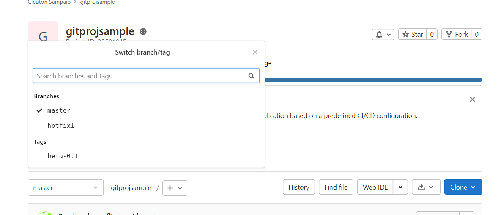

# Tópicos avançados (nem tanto)

Olha, **GCS** tem que ser simples, pois quanto mais simples, mas provável que seja seguida. Inventar fluxos complicados ou utilizar ferramentas suplementares pode complicar sua gestão. Mas tem algumas coisas que, embora não sejam comuns, são úteis considerarmos.

## Tag

Um Tag é uma marca de um determinado **commit**. Os artefatos daquela versão de commit são marcados e podem ser referenciados pelo **Tag**. 

Tags são como **branches** só que são **read only**, ou seja, você pode até baixar o código de um Tag, mas não pode "comitar" nada de volta para ele. Tags são utilizados para marcar pontos interessantes de um projeto ao longo do tempo, por exemplo cada **release** do software. Há dois tipos de tag no Git: 

- lightweight (leve): São apenas uma referência a um **commit**; 
- Annotated (anotado): Além de referências, possuem atributos, como: Autor, Data, email e mensagem;

Vamos usar nosso projeto exemplo e criar um tag "beta-0.1" nele: 

```
>git tag -a "beta-0.1" -m "Primeira versão beta"
>git show
commit 6a06cdbaee4e4a2daf1af3bdc0565336d4ca0348 (HEAD -> master, tag: beta-0.1, origin/master, origin/HEAD)
Author: cleuton <cleuton@xpto>
Date:   Mon Mar 29 14:33:08 2021 -0300

    Campo descricao

```

E podemos enviar o Tag para o repositório remoto: 

```
C:\Users\Cleuton Sampaio\projetos\meuprojetogitlab\gitprojsample>git push origin beta-0.1
Enumerating objects: 6, done.
Counting objects: 100% (6/6), done.
Delta compression using up to 8 threads
Compressing objects: 100% (4/4), done.
Writing objects: 100% (4/4), 472 bytes | 472.00 KiB/s, done.
Total 4 (delta 2), reused 0 (delta 0), pack-reused 0
To https://gitlab.com/cleuton.sampaio/gitprojsample.git
 * [new tag]         beta-0.1 -> beta-0.1
```

Se formos ao website do repositório remoto, podemos ver que o Tag foi criado e está disponível como um **branch**: 



Podemos fazer muitas coisas com Tags, por exemplo acionar mecanismos de **CI/CD** e executar um **build** utilizando um **Tag** como identificador do código, ou podemos fazer **checkout** de um Tag. Por exemplo, o Desenvolvedor 2 atualizou seu repositório local e fez checkout do tag que acabamos de criar: 

```
C:\Users\Cleuton Sampaio\projetos\outrodev\gitprojsample>git checkout beta-0.1
Note: switching to 'beta-0.1'.

You are in 'detached HEAD' state. You can look around, make experimental
changes and commit them, and you can discard any commits you make in this
state without impacting any branches by switching back to a branch.

If you want to create a new branch to retain commits you create, you may
do so (now or later) by using -c with the switch command. Example:

  git switch -c <new-branch-name>

Or undo this operation with:

  git switch -

Turn off this advice by setting config variable advice.detachedHead to false

HEAD is now at 6a06cdb Campo descricao
```

Repare o que aconteceu: Ele mudou a versão dos arquivos na **workspace** para o tag **beta-0.1**, mas nos colocou em estado "detached HEAD", ou seja não podemos fazer **commit** de alterações, a não ser que criemos um novo **branch**. 

Se você precisa alterar os arquivos de determinado **Tag** poderia fazer um checkout assim: 

```
git checkout -b novobranch beta-0.1
```
Agora, você está com o código correspondente ao **tag** **beta-0.1** dentro de um novo **branch** "novobranch". 

## Rebase

O comando **git rebase** é frequentemente mal interpretado, mas ele faz a mesma coisa que o **git merge**: Incorpora um branch em outro. 

A diferença é que o **git merge** junta todos os **commits** feitos no branch que está sendo incorporado em um **merge commit**, dificultando a leitura da história das modificações. O **git rebase** mantém os **commits** intermediários. 

Vamos testar... O Desenvolvedor 1 criou um novo branch: "nova": 

```
C:\Users\Cleuton Sampaio\projetos\meuprojetogitlab\gitprojsample>git add *

C:\Users\Cleuton Sampaio\projetos\meuprojetogitlab\gitprojsample>git commit -m "consertei os imports"
[nova 23b7ed2] consertei os imports
 1 file changed, 2 insertions(+), 2 deletions(-)

C:\Users\Cleuton Sampaio\projetos\meuprojetogitlab\gitprojsample>git push origin nova
Enumerating objects: 5, done.
Counting objects: 100% (5/5), done.
Delta compression using up to 8 threads
Compressing objects: 100% (3/3), done.
Writing objects: 100% (3/3), 309 bytes | 309.00 KiB/s, done.
Total 3 (delta 2), reused 0 (delta 0), pack-reused 0
remote:
remote: To create a merge request for nova, visit:
remote:   https://gitlab.com/cleuton.sampaio/gitprojsample/-/merge_requests/new?merge_request%5Bsource_branch%5D=nova
remote:
To https://gitlab.com/cleuton.sampaio/gitprojsample.git
 * [new branch]      nova -> nova
```

Enquanto isso, o Desenvovledor 2 fez uma alteração no **master**: 

```
C:\Users\Cleuton Sampaio\projetos\outrodev\gitprojsample>git add *

C:\Users\Cleuton Sampaio\projetos\outrodev\gitprojsample>git commit -m "Exibir o erro"
[master d224877] Exibir o erro
 1 file changed, 1 insertion(+)

C:\Users\Cleuton Sampaio\projetos\outrodev\gitprojsample>git push origin master
Enumerating objects: 5, done.
Counting objects: 100% (5/5), done.
Delta compression using up to 8 threads
Compressing objects: 100% (3/3), done.
Writing objects: 100% (3/3), 306 bytes | 306.00 KiB/s, done.
Total 3 (delta 2), reused 0 (delta 0), pack-reused 0
To https://gitlab.com/cleuton.sampaio/gitprojsample.git
   22ce944..d224877  master -> master
```

O Desenvolvedor 1 resolve incorporar as alterações ao branch **master** fazendo um **git merge**, assim como o Desenvolvedor 2. Como fica a história do projeto?

```
commit 08f19ef7a8e3d28364eca2e1831c862f79d1eb3a (HEAD -> master, origin/master, origin/HEAD)
Merge: d224877 23b7ed2
Author: cleuton <cleuton@xpto>
Date:   Tue Mar 30 15:11:02 2021 -0300

    Merge branch 'nova'

commit d22487709b52ded0f8dfb3652260d71f900d1ea0
Author: cleuton <cleuton@xpto>
Date:   Tue Mar 30 15:09:03 2021 -0300

    Exibir o erro

commit 23b7ed217a3e0087982f77f47ec95ab88357e333 (origin/nova, nova)
Author: cleuton <cleuton@xpto>
Date:   Tue Mar 30 15:06:27 2021 -0300

    consertei os imports

commit 22ce94448c891dc89355d514315fff5cf858d9a3 (origin/feature1, feature1)
Author: cleuton <cleuton@xpto>
Date:   Tue Mar 30 14:51:52 2021 -0300

    Adicionei a funcao de negocio

commit 103441904de5b8fe4af9086d534f255aeb1eefc2
Author: cleuton <cleuton@xpto>
Date:   Tue Mar 30 14:45:57 2021 -0300
```

Como podemos ver, a alteração mais recente é um **merge commit**, que parece ser filha das duas alterações anteriores: uma feita no **master** e outra feita no branch **nova**. Isso é mais fácil de ver com a opção de gerar gráfico do **git log**: 

```
C:\Users\Cleuton Sampaio\projetos\meuprojetogitlab\gitprojsample>git log --all --decorate --oneline --graph
*   08f19ef (HEAD -> master, origin/master, origin/HEAD) Merge branch 'nova'
|\
| * 23b7ed2 (origin/nova, nova) consertei os imports
* | d224877 Exibir o erro
|/
* 22ce944 (origin/feature1, feature1) Adicionei a funcao de negocio
* 1034419 Adicionando flag de erro
*   c237c06 Resolvendo conflito servidor.py'
|\
| * 83ab25e (origin/hotfix1) Hotfix1
* | 6a06cdb (tag: beta-0.1) Campo descricao
|/
*   6020428 Resolvendo conflito requirements.txt
|\
| *   f7b21c8 Merge branch 'master' of https://gitlab.com/cleuton.sampaio/gitprojsample
| |\
| * | 87b63cc Adicionando gunicorn
* | | b29a985 Modificando para incluir requests
| |/
|/|
* | 47938a7 Merge branch 'master' of https://gitlab.com/cleuton.sampaio/gitprojsample
|\|
| * 525fc20 Código fonte
* | a197e4a Adicionando cliente
|/
* 90b6956 Initial commit
```

O **git merge** afeta a ancestralidade das alterações e mantém os **merge commits** na história do repositório. 

### Isso é ruim?

Depende... Alguns consideram que fica antinatural esse monte de **merge commit** e que, em grandes equipes, com muitos merges, isso pode confundir a análise da história do projeto. 

Pessoalmente, prefiro as coisas mais simples e o **git merge** é a maneira como sempre trabalhamos. Mas vamos ver como funciona o **git rebase**.

### git rebase

A principal vantagem do **git rebase** é manter a linha do tempo e a ancestralidade dos **commits**, evitando a geração de **merge commits**. 

Para demonstrar isso, faremos nova alteração. O Desenvolvedor 1 resolveu criar uma nova branch para desenvolver uma funcionalidade: 

```
C:\Users\Cleuton Sampaio\projetos\meuprojetogitlab\gitprojsample>git add *

C:\Users\Cleuton Sampaio\projetos\meuprojetogitlab\gitprojsample>git commit -m "Adicionando funcao verifica codigo"
[novafuncionalidade 665f75e] Adicionando funcao verifica codigo
 1 file changed, 10 insertions(+), 3 deletions(-)

C:\Users\Cleuton Sampaio\projetos\meuprojetogitlab\gitprojsample>git push origin novafuncionalidade
Enumerating objects: 5, done.
Counting objects: 100% (5/5), done.
Delta compression using up to 8 threads
Compressing objects: 100% (3/3), done.
Writing objects: 100% (3/3), 398 bytes | 398.00 KiB/s, done.
Total 3 (delta 2), reused 0 (delta 0), pack-reused 0
remote:
remote: To create a merge request for novafuncionalidade, visit:
remote:   https://gitlab.com/cleuton.sampaio/gitprojsample/-/merge_requests/new?merge_request%5Bsource_branch%5D=novafuncionalidade
remote:
To https://gitlab.com/cleuton.sampaio/gitprojsample.git
 * [new branch]      novafuncionalidade -> novafuncionalidade
```

Enquanto isso, o Desenvolvedor 2 pegou um erro no código e consertou diretamente no **master**: 

```
C:\Users\Cleuton Sampaio\projetos\outrodev\gitprojsample>git add *

C:\Users\Cleuton Sampaio\projetos\outrodev\gitprojsample>git commit -m "Consertei erro faltando dois pontos"
[master b342b53] Consertei erro faltando dois pontos
 1 file changed, 1 insertion(+), 1 deletion(-)

C:\Users\Cleuton Sampaio\projetos\outrodev\gitprojsample>git push origin master
Enumerating objects: 5, done.
Counting objects: 100% (5/5), done.
Delta compression using up to 8 threads
Compressing objects: 100% (3/3), done.
Writing objects: 100% (3/3), 300 bytes | 300.00 KiB/s, done.
Total 3 (delta 2), reused 0 (delta 0), pack-reused 0
To https://gitlab.com/cleuton.sampaio/gitprojsample.git
   08f19ef..b342b53  master -> master
```

Ok, agora o Desenvolvedor 1 fará um **git rebase**. Para evitar problemas, ele deve mudar para o **master** e atualizá-lo com a origem:

```
C:\Users\Cleuton Sampaio\projetos\meuprojetogitlab\gitprojsample>git checkout master
Switched to branch 'master'
Your branch is up to date with 'origin/master'.

C:\Users\Cleuton Sampaio\projetos\meuprojetogitlab\gitprojsample>git pull
remote: Enumerating objects: 5, done.
remote: Counting objects: 100% (5/5), done.
remote: Compressing objects: 100% (3/3), done.
remote: Total 3 (delta 2), reused 0 (delta 0), pack-reused 0
Unpacking objects: 100% (3/3), 280 bytes | 28.00 KiB/s, done.
From https://gitlab.com/cleuton.sampaio/gitprojsample
   08f19ef..b342b53  master     -> origin/master
Updating 08f19ef..b342b53
Fast-forward
 servidor.py | 2 +-
 1 file changed, 1 insertion(+), 1 deletion(-)
```

Então, com o **master** local atualizado, ele muda para o branch **novafuncionalidade**, que ele deseja incorporar e dispara o **git rebase**: 

```
C:\Users\Cleuton Sampaio\projetos\meuprojetogitlab\gitprojsample>git checkout novafuncionalidade
Switched to branch 'novafuncionalidade'

C:\Users\Cleuton Sampaio\projetos\meuprojetogitlab\gitprojsample>git rebase master
error: could not apply 665f75e... Adicionando funcao verifica codigo
Resolve all conflicts manually, mark them as resolved with
"git add/rm <conflicted_files>", then run "git rebase --continue".
You can instead skip this commit: run "git rebase --skip".
To abort and get back to the state before "git rebase", run "git rebase --abort".
Could not apply 665f75e... Adicionando funcao verifica codigo
Auto-merging servidor.py
CONFLICT (content): Merge conflict in servidor.py
```

Naturalmente, ocorreu um conflito. Ele está no branch **novafuncionalidade** e precisa resolver o conflito, enviar para **index** e depois continuar o rebase: 

```
C:\Users\Cleuton Sampaio\projetos\meuprojetogitlab\gitprojsample>git add *

C:\Users\Cleuton Sampaio\projetos\meuprojetogitlab\gitprojsample>git rebase --continue
hint: Waiting for your editor to close the file...
[detached HEAD f8ef7af] Adicionando funcao verifica codigo
 1 file changed, 12 insertions(+), 3 deletions(-)
Successfully rebased and updated refs/heads/novafuncionalidade.

C:\Users\Cleuton Sampaio\projetos\meuprojetogitlab\gitprojsample>git status
On branch novafuncionalidade
nothing to commit, working tree clean
```

E agora? Agora, ele precisa fazer um merge com o **master**. O branch **novafuncionalidade** já teve sua referência atualizada, agora é só juntar ao **master**, o que acontece na modalidade **fast forward**. Depois, precisamos fazer um **git push**: 

```
C:\Users\Cleuton Sampaio\projetos\meuprojetogitlab\gitprojsample>git checkout master
Switched to branch 'master'
Your branch is up to date with 'origin/master'.

C:\Users\Cleuton Sampaio\projetos\meuprojetogitlab\gitprojsample>git merge novafuncionalidade
Updating b342b53..f8ef7af
Fast-forward
 servidor.py | 15 ++++++++++++---
 1 file changed, 12 insertions(+), 3 deletions(-)

C:\Users\Cleuton Sampaio\projetos\meuprojetogitlab\gitprojsample>git status
On branch master
Your branch is ahead of 'origin/master' by 1 commit.
  (use "git push" to publish your local commits)

nothing to commit, working tree clean

C:\Users\Cleuton Sampaio\projetos\meuprojetogitlab\gitprojsample>git push origin master
Enumerating objects: 5, done.
Counting objects: 100% (5/5), done.
Delta compression using up to 8 threads
Compressing objects: 100% (3/3), done.
Writing objects: 100% (3/3), 410 bytes | 410.00 KiB/s, done.
Total 3 (delta 2), reused 0 (delta 0), pack-reused 0
To https://gitlab.com/cleuton.sampaio/gitprojsample.git
   b342b53..f8ef7af  master -> master
```

Funcionou? Se rodarmos outro git log com opção de gráfico, veremos que sim. Não há **merge commit** e as alterações aparecem em sequência correta no **master**: 

```
C:\Users\Cleuton Sampaio\projetos\meuprojetogitlab\gitprojsample>git log --all --decorate --oneline --graph
* f8ef7af (HEAD -> master, origin/master, origin/HEAD, novafuncionalidade) Adicionando funcao verifica codigo
* b342b53 Consertei erro faltando dois pontos
| * 665f75e (origin/novafuncionalidade) Adicionando funcao verifica codigo
|/
```

O branch **novafuncionalidade** pode até ser apagado do repositório, pois ficou "órfão". 

### Merge ou rebase

Sinceramente? Dá muito trabalho fazer **rebase**. Há soluções automatizadas para isto, como o [**git flow**](https://www.atlassian.com/br/git/tutorials/comparing-workflows/gitflow-workflow). 

Eu recomendo utilizar o fluxo normal do **Git** que é utilizar o **merge** comum. Coisas como **git flow** aumentam a **entropia** do projeto, acescentando complexidade dificilmente justificável. Mas, se quiser manter a história menos poluída, usar **rebase** é a solução e, se for realmente usar isso, considere o **git flow**.

 