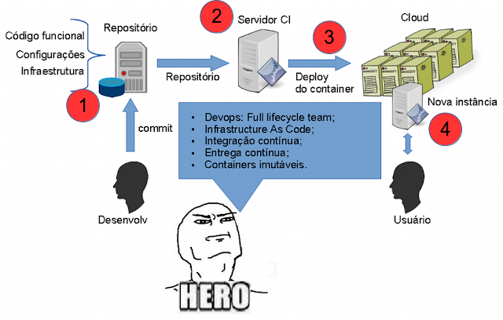
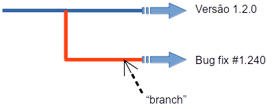
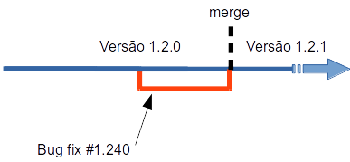
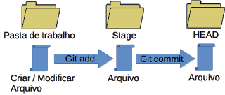
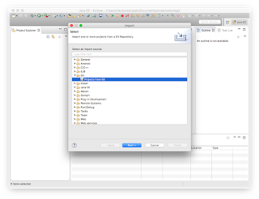
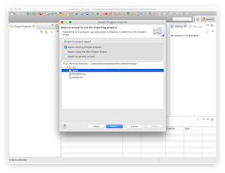

# Papo sobre software, com quem entende!

(c) 2018 [**Cleuton Sampaio**](https://github.com/cleuton).

# Gestão de configuração de software  e ciclo de desenvolvimento

As mudanças acontecem com frequência muito maior atualmente, logo, precisamos entender como gerir configuração de software e como isto se incorpora ao trabalho do ciclo de desenvolvimento de um projeto de software.

No final deste texto há um [**tutorial rápido de Git**](#batendo-bola-com-o-git) para você "sair do zero"!

**O que é um “item de configuração”?**

Em [**gestão de mudanças**](https://www.devmedia.com.br/gerencia-de-configuracao-e-mudancas/31327), um item de configuração é um artefato que caracteriza a configuração de um projeto.

Ok, a definição está vaga… Vamos pensar em software. O que caracteriza a configuração de um software? Sim, a maneira como o software funciona agora, neste momento? Podemos listar algumas coisas:
- Documentação;
- Código-fonte funcional;
- Código-fonte de infraestrutura;
- Arquivos de propriedades ou de configuração;

Estes artefatos descrevem a configuração atual de um software. Se forem perdidos ou comprometidos, pode ser difícil executar ou recuperar o software. 

Precisamos armazená-los de forma segura e, ao mesmo tempo, permitirmos consultas e manutenção dos mesmos. 

Agora, uma pergunta para você: O arquivo executável de um software (“exe”, “war” etc) é um item de configuração?

A melhor resposta é: sim e não! Teoricamente, se perdermos o “executável”, podemos recriá-lo com os itens de configuração, logo, ele é descartável. 

Mas, como podemos ter certeza de que determinado arquivo “executável” é a versão atual, ou pelo menos, a que desejamos executar? Como garantimos que ele foi gerado sem “contaminação” (versões de desenvolvimento, “backdoors”, “trojan horses” etc)? A resposta é simples: Gestão de configuração através de [**integração contínua**](http://www.obomprogramador.com/2015/06/antenado-com-as-novidades-em-ti.html). Mas isto já é assunto para outro post...



Na figura acima, vemos o **nirvana** do Ciclo de vida de software: 
1. **Gestão de configuração**: Controle de versão de Itens de configuração;
2. **Integração contínua**: Execução de testes automatizados e compilação "sala limpa";
3. **Entrega contínua**: Gerar contínuamente novas versões executáveis, entregando-as em qualquer ambiente;
4. **Containers imutáveis**: Empacotar os executáveis em **Containers** que não podem ser alterados (evitando **configuration drift**).

**Versionamento**

Itens de configuração precisam ser versionados. Por quê? Para recuperar determinada versão. O que é uma “configuração” de software afinal? É um conjunto de itens de configuração, em determinada versão “congelada”. Mas por que precisamos controlar a versão? Porque precisamos poder reconstruir nosso executável a partir dos itens de configuração, e, para isto, precisamos saber quais versões fazem parte de determinada “baseline” do software.

Ficou complicado? Vamos tentar descomplicar… Imagine que estamos trabalhando na versão 3.4.0 do nosso software. Para criá-la, precisamos de alguns itens de configuração,  em determinadas versões: 
- Programa XPTO, versão 2.1.7;
- Programa ABCD, versão 1.4.0;
- Arquivo de propriedades, versão 2.2.0.

Geralmente, mantemos nossos itens de configuração em um Software de Gestão de Versões (SCM – Software Configuration Management), como o [**Git**](https://git-scm.com/) ou o [**Subversion**](https://subversion.apache.org/). Eles gerenciam as versões dos itens de configuração e permitem fazer operações avançadas, como “merges”.

**Checkout e commit**

Os SCMs usam nomes diferentes para essas operações, mas a comunidade de desenvolvedores as conhece muito bem por esses nomes:
Checkout: Obter uma versão de um item de configuração, copiando-a para sua máquina local. Pode ser a última versão ou pode ser uma versão específica;
Commit: Entregar uma versão de um item de configuração para o SCM. Geralmente, fazemos “commit” quando a versão já está testada. 

Existe ainda a operação de “**Update**”, que baixa novas alterações dos itens de configuração, incorporando-as nas versões que você baixou. 

Em alguns SCMs, essas operações são feitas em etapas. No Git, por exemplo, podemos fazer várias operações:
- **Clone**: Baixa todo um repositório remoto para a nossa máquina;
- **Fetch**: Trás todas as alterações de um repositório (“master”, Tag ou “branch”), mas não as incorpora ao seu repositório local;
- **Pull**: Faz um “Fetch” e incorpora as alterações no seu repositório local;
- **Add**: Adiciona alterações ao “stage” do seu repositório;
- **Commit**: Incorpora as alterações que estavam em “stage” ao seu repositório;
- **Push**: Envia as alterações feitas no seu repositório, para o repositório remoto, no servidor;

Mas o objetivo deste post não é ensinar Git (faremos isso em outro post).

**Baseline**

Todo software tem o conceito de “versão”, certo? Há vários “esquemas” de versionamento de software, mas eu gosto muito do [**SEMVER**](https://semver.org/) ou “Semantic versioning” (versionamento semântico). 

Segundo o SEMVER, o número de versão de um software é composto por três partes:

MAJOR.MINOR.PATCH

1. MAJOR: Número da versão do software. Mudanças neste nível criam incompatibilidades com quaisquer versões anteriores;
2. MINOR: Número da versão intermediária do software. Mudanças neste nível deveriam apresentar compatibilidade retroativa com versões intermediárias anteriores;
3. PATCH: Número da revisão de bug-fixes. Mudanças compatíveis retroativamente de correção de bugs;

Por exemplo, entendemos que a versão 2.2.0 poderia ser utilizada com os dados gerados pela versão 2.1.5. Mas não há garantias de que funcionaria com os dados da versão 1.7.0. 

O que é um “baseline”? É um “congelamento” de versões dos itens de configuração, que pode ser demarcado no seu Software de Gestão de Versões. 

Podemos ter vários “baselines” em nosso projeto, por exemplo, um para cada versão do software que liberamos para o público (ou colocamos em “produção”). Mas podemos ter “baselines” intermediários. Vamos supor que você tenha duas manutenções grandes, feitas em “branches” (calma) separados, e quer juntá-las ao “trunk” (tenha calma!). Você pode juntar a primeira, criar um “baseline” e juntar a segunda. Assim, é possível voltar uma versão facilmente.

**Branches**

Pense em uma árvore, pois “branch” quer dizer “galho” ou “ramo”. Podemos pegar uma versão de um software (uma “baseline”) e criar um “branch” a partir dela:


Todos os artefatos da versão 1.2.0 continuam lá e podem estar sendo alterados. Mas, a partir do ponto onde foi criado o “branch” foi “congelada” uma versão, marcada com o nome “Bug fix # 1.240”. Se você obtiver um item deste “branch” ele terá a mesma versão do momento em que o “branch” foi criado, mesmo que o arquivo original, no “branch” 1.2.0, tenha sido modificado.

Por que criamos “branches”? O exemplo da figura demonstra isso. Há uma versão em desenvolvimento (1.2.0) porém encontramos um erro que precisa ser remediado (Bug 1.240), que pode ter sido registrado no nosso software de relatos de problemas, como o [**Jira**](https://br.atlassian.com/software/jira), por exemplo. Para não atrapalhar o desenvolvimento, criamos um “branch” temporário.

**Trunk**

É o nome do “branch” “sem nome” de um projeto. Parece engraçado, não? Todo Software de Gestão de Versão tem esse conceito. Você pode chamar do que quiser. Por exemplo, no Git é chamado de “master” branch. No SVN é chamado de “trunk”.

Pense no “trunk” como o “tronco” principal do projeto. Dele, derivam todos os “branches” e a ele voltarão em um futuro.

No Git há o conceito de “HEAD”, que algumas pessoas confundem com “trunk”, mas não é. “HEAD” é o “branch” em que você está trabalhando no momento. O “trunk” no Git é o “master”.

Há duas maneiras diferentes de encarar o “trunk”: Estável ou Desenvolvimento. Isto é determinado pela “política de commit”, que é como trabalhamos com o “trunk”.

Se a política for “**trunk estável**”, então o “branch” “trunk” sempre contém a versão mais estável do software, onde todos os bug-fixes são aplicados imediatamente. Geralmente, a versão do software que está no “trunk” é mais antiga que a que está sendo desenvolvida, mantida em um “branch” separado. Esta versão é chamada de [**“stable”**](https://en.wikipedia.org/wiki/Software_release_life_cycle).

Se a política for “**Desenvolvimento no trunk**”, então a versão que está no “trunk”, portanto sem nenhuma marca, é a última versão do software, a qual vem sendo desenvolvida constantemente. Se quisermos uma versão “estável”, devemos procurar um “branch” específico.

**Tag vs Branch**

Outro conceito que existe e serve para demarcar “baselines” é o Tag. Um Tag é um rótulo que colocamos em versões dos itens de configuração, semelhante a um “branch”, porém, diferentemente do “branch”, não é feita uma cópia separada dos artefatos. Apenas marcamos um conjunto de versões.

Um “branch” é uma ramificação completa, criada para ser temporária. Um Tag é uma marca, que pode ser utilizada para separar versões estáveis do software que, geralmente, é para sempre.

Por exemplo, antes de liberar uma versão já testada, é costume marcar todos os artefatos com um Tag. Assim, podemos recuperá-los e regerar o “executável” a qualquer momento.

O custo e o espaço ocupado pelo Tag tendem a ser menores que os do “branch”.


**Merge**

É a operação de reconciliar um “branch” com outro. É a maior dor de cabeça dos desenvolvedores e pode causar muitos problemas. 

Por que fazemos isto? Se você trabalha com política de “trunk estável”, cria “branches” para versões em desenvolvimento. Quando estas versões estão testadas, é o momento de incorporá-las ao “trunk”. Outra necessidade é incorporar “branches” de correções (“bug fixes”) em um “branch” de desenvolvimento ou no “trunk”.

As ferramentas, como o Git, oferecem suporte ao “merge”. Elas comparam as modificações feitas em cada item de configuração. As modificações que não conflitarem, podem ser feitas automaticamente. Porém, se houver conflitos (duas versões diferentes alteram as mesmas linhas) isto é marcado em um arquivo especial para que os desenvolvedores decidam como deve ser feita a incorporação.



Na figura, vemos que em determinado momento, houve a necessidade de corrigir um “bug” (número 1.240), durante o desenvolvimento da versão 1.2.0. Fizemos um “branch” e trabalhamos no “bug”. Depois de pronto e testado, fizemos um “merge” e geramos a versão 1.2.1.

É interessante considerar alguns fatos importantes: 
O “branch” da versão 1.2.0 pode ou não ser o “trunk”;
O trabalho de desenvolvimento pode ou não ter continuado após a criação do “branch” “Bug fix #1.240”;
Pode haver conflitos ao juntar as alterações propostas pelo “bug fix” com as que porventura tenham sido feitas no “branch” original.

**Gestão de configuração**

Em projetos muito voláteis, pode haver várias mudanças em andamento. Algumas paralelas e outras, “**OOB**” (out-of-band) ou emergenciais.

Podemos ter uma ou mais solicitações de mudança em desenvolvimento e temos que gerenciar a liberação das mesmas (gestão de “release”). Alguém, com poder de decisão suficiente, dirá quais solicitações de mudança entrarão na próxima versão programada do software.

Podemos ter um ciclo de novas versões, por exemplo, mensal. A cada mês, geramos e liberamos uma nova versão do software. O gestor de liberação indica quais solicitações de mudança serão incluídas nas próximas versões.

Mas existem exceções, que não seguem o fluxo convencional, como os “**bug fixes**” (resolução de problemas ou falhas). Eu costumo chamar de mudanças “OOB” (out-of-band). Podem ter criticidade alta ou baixa, dependendo do “bug”. As mudanças “OOB” críticas precisam entrar no ar imediatamente, caso contrário, o software pode parar. Outras, podem esperar até a próxima liberação.

Em um cenário destes, você pode ter várias “subequipes” trabalhando em solicitações de mudança diferentes. Alguns podem estar implementando “bug fixes”, outros podem estar trabalhando em solicitações de mudança rotineiras, e alguns outros podem estar trabalhando em novas funcionalidades.

Podemos lidar essa situação criando “branches” para cada “subequipe” trabalhar. Mesmo assim, precisaremos gerenciar alguns problemas:

1. Um “bug fix” precisa ser incorporado a todos os “branches”? Ou podemos incorporar apenas ao “trunk”?
2. Uma SM (Solicitação de Mudança) precisa ser incorporada a outra?
3. Uma SM conflita com outra? Pode torná-la mais difícil ou mesmo desnecessária?

Quando temos um cenário destes, com múltiplos “branches” em desenvolvimento, é necessário gerenciar as Solicitações. Precisamos ver o que já está sendo feito e se o problema relatado ou a nova funcionalidade já está sendo feito.

Certamente, você terá outro problema pela frente: Múltiplas versões do “executável” para testar! E terá que gerá-las separadamente e sob demanda, ou seja, a cada nova implementação, um novo “executável” é gerado e disponibilizado para os usuários avaliarem. 

A [**integração contínua e a entrega contínua**](https://www.4linux.com.br/diferencas-entre-integracao-deploy-e-entrega-continua) podem ajudar.

Boas práticas

Gerenciar projetos grandes, com muitas pessoas e uma alta frequência de manutenção pode ser um enorme desafio. Algumas boas práticas podem ajudar, e faz parte do papel de um “líder” técnico (ou arquiteto de software) reforçá-las junto à equipe do projeto.

1. Use a política de “trunk estável”, criando “branches” para cada solicitação de mudança ou “bug fix”;
2. Evite criar “branches” para cada desenvolvedor, pois isso só aumenta os problemas de gestão;
3. Adote a diretriz: Não pode “quebrar” build! Membros da equipe só podem fazer “commit” se suas alterações tiverem sido testadas. Não pode subir alterações só para fazer “backup”;
4. Mantenha rastreamento de todas as Solicitações de Mudança (SM), “bug fixes”, “branches” e pessoas. Crie uma planilha relacionando todos eles;
5. Só incorpore “bug fixes” no “trunk”. Evite incorporá-los nos “branches” das SMs, exceto se os “bugs” estiverem criando problemas;
6. Antes de começarem a trabalhar, os desenvolvedores de um “branch” devem fazer um “Update”, para saber se alguma mudança conflita com o que estão fazendo. Isto deve ser feito apenas ao nível do “branch”. Conflitos em “branches” devem ser resolvidos o mais rapidamente possível.

# Batendo bola com o Git


Git é um sistema de versionamento de código-fonte livre e distribuído. É rápido, seguro e Open Source, sendo utilizado amplamente no mundo inteiro. Ele foi desenvolvido por Linus Torvalds, o criador do Linux, e é distribuído sob licença GPL.

O Git se encaixa na categoria dos softwares de repositório de fonte, como o [**CVS**](https://pt.wikipedia.org/wiki/CVS) ou o [**Subversion**](https://pt.wikipedia.org/wiki/Subversion). Existem soluções proprietárias também, como o IBM Jazz Source Control, que faz parte da solução ALM vendida por ela.

Eu comecei a usar repositórios há muito tempo, com o saudoso Microsoft Source Safe, depois migrei para o CVS, SVN, e, por fim, estou usando o Git e adorando.

**Por que o Git é diferente?**

Para começar, ele é distribuído. Quando você cria um repositório Git, ele é totalmente autônomo, e funciona independente de rede e de servidor. Porém, você pode sincronizar o conteúdo com repositórios externos, replicando suas atualizações.

Ele rastreia o conteúdo todo do repositório, gerenciando suas várias versões separadamente, permitindo o desenvolvimento não linear, com recursos de "branch" e "tag".

Várias IDEs, como o Eclipse, possuem plugins para lidar com o Git.

**Como funciona um repositório Git?** 

O repositório é uma coleção de arquivos refletindo os vários estados dos artefatos armazenados. 

```
MBP-de-CLEUTON:repositorio cleutonsampaio$ cd .git
MBP-de-CLEUTON:.git cleutonsampaio$ ls
COMMIT_EDITMSG    branches    hooks        logs
FETCH_HEAD    config        index        objects
HEAD        description    info        refs
```

O repositório fica em uma pasta ".git", dentro da pasta onde você o criou. O seu conteúdo, não nos interessa, pois lidamos com o Git a partir de comandos específicos ele, e não usando o File System.

Geralmente, os projetos em um repositório Git são (ou serão) sincronizados com um repositório Git remoto, que pode ser o Github, por exemplo.

Quando você cria um novo arquivo (ou um conjunto de arquivos, ou pastas), é necessário adicioná-lo ao repositório, isto é feito em duas etapas: primeiro, você o adiciona a uma "workspace" ou área de "staging", e depois, você faz o "commit" para o repositório.

Depois de alterar os arquivos e fazer commit, geralmente, você faz um "push" para o repositório remoto.

O fluxo de trabalho Git é sempre o seguinte:

1. Crie um projeto ou clone um repositório;
2. Adicione novos arquivos ou altere os já existentes;
3. Faça commit, informando uma mensagem;
4. Faça "push" para o repositório remoto.

**Baixando o Git**

Se o seu sistema operacional é Linux, há uma boa chance dele já vir com o Git instalado. Se for derivado de Debian, você pode verificar isso com:
```
git --version
```

Se o Git não estiver instalado, você poderá instalar, dependendo do seu sistema operacional:

- Linux Ubuntu: Primeiro, atualize os pacotes como "sudo apt-get update" e depois instale o Git com "sudo apt-get install git";
- RedHat (Fedora etc): sudo yum install git;
- Mac OSX: Baixe e rode o instalador http://git-scm.com/download/mac;
- MS Windows: Baixe e rode o instalador https://git-scm.com/download/win;

**Criar projetos**

Eu tenho a prática de criar um repositório diferente para cada projeto, mas nada impede que você coloque vários projetos em um repositório único, separando cada um em sua própria pasta.

Para criar um repositório Git, crie uma nova pasta, entre nela (CD) e rode o comando:  
```
git init
```
Agora, você pode criar arquivos ou copiar arquivos para a pasta onde criou o repositório, usando-a como uma "workspace". Por exemplo, crie um arquivo simples, chamado "leiame.txt" e copie-o para a pasta onde criou o repositório. Agora, adicione-o à área de trabalho com o comando "add":
```
git add leiame.txt
```
O arquivo foi adicionado, mas ainda não faz parte do repositório. Para que ele se torne parte da árvore do repositório, é necessário fazer um "commit". Quando "comitamos" alterações, sempre devemos informar alguma mensagem, ou seja, um pequeno texto que identifique o que fizemos. Por exemplo:
```
git commit -m "versao inicial"
```
O Git vai dar algumas mensagens, dizendo que nosso username e nosso email foram configurados automaticamente, mas não tem problema.

O fluxo de trabalho pode ser resumido assim:



Quando seu arquivo é comitado, ele está no HEAD da árvore de versões, ou seja, na última versão do repositório.

Quando um arquivo é adicionado, ele passa a ter suas alterações controladas pelo Git. Ao realizarmos um conjunto de alterações, devemos fazer um "commit", para que elas sejam adicionadas ao HEAD e fiquem disponíveis.

Se você criou o repositório do zero, você não tem um repositório remoto configurado. É sempre uma boa prática usar um repositório remoto, onde você poderá concentrar as alterações feitas por outros desenvolvedores. O Github oferece hospedagem de repositórios Git remotos, mas você pode usar o Gitlab e criar seu próprio agregador de repositórios.

Para adicionar um repositório remoto, é necessário ter a URL dele. Pode ser protocolo Git ou HTTPS. Vou usar um exemplo que tenho no Github o [**jQana**](https://github.com/cleuton/jqana.git):
```
git remote add origin https://github.com/cleuton/jqana.git
```
O nosso repositório agora está ligado a um repositório remoto, que chamados de "origin", com aquela URL.

Porém, o conteúdo que temos no nosso repositório não contempla o do repositório remoto. É necessário obter o conteúdo que existe na última versão, dentro do repositório remoto. Isso pode ser feito com o comando "git pull"
```
git pull origin master
```
O comando pull é uma mescla dos comandos "fetch" e "merge". Informamos o nome do repositório remoto e o nome do "branch" que queremos puxar. Geralmente é o "master", que é o "trunk", ou seja o branch principal do repositório.

Após executar esse comando, você notará que uma nova pasta foi criada dentro da workspace (o diretório onde o repositório foi criado). Ela contém o que veio do repositório remoto.

Podemos alterar, excluir ou adicionar arquivos ao nosso repositório, sincronizando-o com o remoto. Um repositório local pode ter vários repositórios remotos.

**Adicionando pastas**

Você pode usar o comando Git Add para adicionar pastas ou arquivos, incluindo de forma recursiva:
```
git add --all
```

**Clonando repositórios**

Se você vai baixar um projeto de um repositório remoto, a maneira mais prática é "clonar" o repositório. Crie uma nova pasta, use o Git Init e rode o comando:
```
git clone <url do repositório remoto>

git clone https://github.com/cleuton/jqana.git
```

Quando clonamos um repositório, todas as alterações já vem com a última versão.

Enviando alterações para o remoto
Se você fizer alterações em vários arquivos, que não tenham sido recentemente adicionados, use o flag "a":
```
git commit -am "<mensagem>"
```

Depois de você adicionar, alterar e fazer "commit", você pode atualizar o repositório remoto com o comando:
```
git push origin master
```

Usando o Git com o Eclipse
Crie uma nova workspace, e use o comando "FILE / IMPORT", selecionando "Other" e depois: "Git":



Indique onde está o repositório Git:


Mande importar o projeto:



Depois, se fizer alterações, você pode selecionar o projeto e, no menu de contexto, selecionar: "Team / Commit" e depois "TEAM / PUSH...".