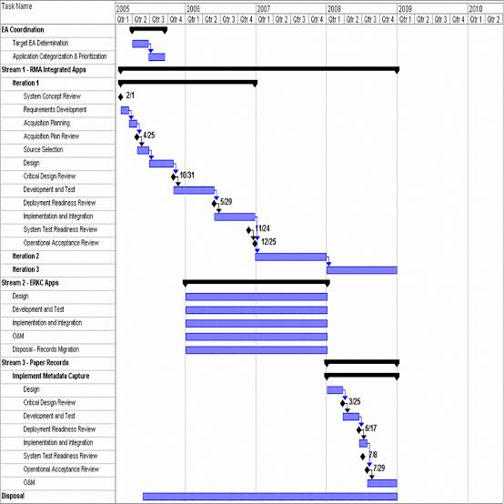

# Papo sobre software, com quem entende!

(c) 2018 [**Cleuton Sampaio**](https://github.com/cleuton).

# Gestão de Tempo

Todo projeto, seja **agile**, **cascata**, **iterativo** ou qualquer outro tipo de processo que você use, é guiado por 3 restrições: 

- **Escopo**: O que será feito, daquilo que é esperado pelo Cliente;
- **Prazo**: Quanto tempo demorará;
- **Custo**: Quanto custará.

E há mais uma restrição adicional: 

- **Qualidade**: Quais são as capacidades esperadas? Quais são as métricas esperadas?

A **gestão de tempo** é todo o esforço adicional para garantir que todas as restrições sejam atendidas. Ela impacta diretamente todas as outras. Não é apenas "prazo", é muito mais do que isso. Por exemplo, vejamos os problemas com os quais a gestão de tempo precisa lidar: 

- Estimativas;
- Disponibilidade de pessoas;
- Disponibilidade de recursos;
- Impactos de mudanças e riscos;

Como vê, não é tão simples. 

## Gestão de tempo

Como eu disse no início, independentemente do modelo de processo de desenvolvimento que utiliza, terá que gerenciar o tempo. E isso consiste em: 

- **Estimativas**: Garantir o que pode ser entregue dentro do prazo;
- **Recursos humanos**: Disponibilidade dos profissionais, capacitações necessárias;
- **Insumos**: Computadores, espaço em disco, repositórios, permissões necessárias etc;

Tudo isso precisa ser estimado, requisitado e contabilizado e, como não dispomos de recursos ilimitados, devem ser desalocados quando se tornarem desnecessários. 

Se você não faz isso diretamente, alguém está fazendo por você. Ou pelo menos, deveria estar fazendo! 

### Estimativas

O que entende sobre isso? Estimativa é o quanto precisa e por quanto tempo. Por exemplo: 

*Para desenvolver a rotina de atualização dos Bilhetes, preciso de 2 desenvolvedores seniores, experientes em Java e React, por 20 horas*

Essas **20 horas** seriam diretas? Seriam divididas em períodos de 8 horas por dia? Seriam dias consecutivos? Isso não faz parte da estimativa. A estimativa é de uso ou esforço. O gestor do recurso pode disponibilizá-lo em períodos fracionados, ou depois de algum tempo. Contar com os recursos a todo momento é um **erro primário**.

Estimativas também podem ser relativas a insumos: 

*Preciso de 3 GB de espaço em disco para desenvolvimento e 5 para produção* ou
*Quero autorização para 3 desenvolvedores usarem o serviço XPTO*

Neste caso, é necessário contar com o tempo que o gestor do insumo demorará para processar sua requisição. E também existe o **risco** do seu acesso ser negado! E você tem que planejar isto!

Eu costumo dizer que boas estimativas garantem metade do sucesso de qualquer projeto. Eu vivi isso na prática! Se você estimou bem é porque avaliou os riscos, capacidades e dificuldades, portanto, já evitou metade dos possíveis problemas.

Estimativas devem ser objetivas, ou seja, baseadas em fatos, e o mais precisas possível. 

E você deve considerar as outras restrições ao fazer suas estimativas: **escopo**, **custo** e **qualidade**. Um erro comum é tentar entregar mais ou menos do que foi combinado, ou de forma precária. Ai entra a famigerada **definição de pronto** - **definition of done**. Pronto é pronto! Não importa se você está usando métodos ágeis ou não. Esse negócio de entregar software *meia bomba* sem testes eficazes e sem documentação apropriada é o maior erro que um profissional de Tecnologia da Informação pode cometer. 

### Recursos humanos

Muita gente erra nisso, negligenciando o que significa trabalhar com pessoas. Vamos começar pelo óbvio: **disponibilidade**. Há muitos fatores que afetam a disponibilidade de uma pessoa, entre eles: 

- **Afastamentos**: Férias, feriados, doenças, problemas pessoais;
- **Prioridades**: Projetos e tarefas mais prioritários, que podem diminuir a disponibilidade da pessoa;
- **Capacidade**: Há pessoas mais rápidas e pessoas mais lentas, e o nível de senioridade influencia isso;
- **Capacitação**: Mesmo sendo sênior, a pessoa pode carecer de conhecimento e/ou experiência nas técnicas necessárias;

E também há fatores subjetivos que podem afetar a **produtividade** de uma pessoa, por exemplo, a **insatisfação** com falta de promoção e reconhecimento, ou então a **contrariedade** em trabalhar naquilo ou com quem não gosta. 

Vejo muitas equipes contarem com trabalho em fins de semana e feriados, como se isso fosse normal. Exigindo da equipe um alto nível de sacrifício. Isso é muito comum em modelos de desenvolvimento subjetivos, com estimativas igualmente subjetivas. Tal prática é **errada**, **cara** e pode levar as pessoas ao **esgotamento**, diminuindo a **produtividade** e **competitividade** da Empresa.

É ilusão pensar que pode manter sua equipe em **um ritmo sustentável de trabalho**. Isso é lindo no **Manifesto Ágil**, porém impraticável na vida real. Pessoas precisam de ciclos de alta e baixa produtividade. Ignorar isso é **burrice**.

Outro erro muito comum é pensar que todos estão motivados da mesma maneira e que a **sinergia** fará com que as pessoas se envolvam no projeto. Isso é **tolice**. Pessoas precisam de **tarefas**, de **objetivos** a cumprir. Esse negócio de colocar no **Kanban** e esperar que as pessoas tomem a iniciativa de puxar tarefas é a mais completa **idiotice** que já vi. Jamais deu certo e jamais dará! É infantil pensar assim. 

**É tão ingênuo que chega a ser bonitinho!**

Eu tenho um grande amigo, Felipe, que costuma proferir a frase acima, quando se depara com tolices como essas. 

E você não convencerá um gestor de pessoas a liberá-las por mais tempo do que o necessário, apenas para cumprir **cerimônias**. Não. Tudo tem custo e precisa ser justificado. Se você precisa de **cerimônias** para cumprir seu trabalho, então deveria trabalhar em uma igreja e não em uma empresa de software.

Você trabalhará com pessoas que não estão diretamente sob sua gestão, ou seja a famosa **Gestão matricial**, e terá que lidar com problemas que não são da sua alçada. 

Você precisa estimar bem o tempo que precisará dessas pessoas e usá-lo com muita sabedoria e parcimônia, pois isso refletirá na contabilização do tempo delas. 

### Insumos

Insumo é qualquer coisa que um projeto necessite, além de pessoas. Por exemplo, cotas de espaço em disco ou de CPU. Permissão para acessar funções, disponibilização de acessos remotos, regras de firewall etc. Como vê, nada é tão simples como no **mundo de unicórnios** que a moderna gestão de projetos se tornou.

Você precisa estimar o tempo, a quantidade e o tipo de insumos que necessitará. Alguns são para uso temporário e outros para uso permanente. Isso impactará diretamente os **recursos humanos**. Certa vez vi 5 desenvolvedores ficarem à toa por 1 semana devido à falta de permissão em determinado ambiente. Nada podiam fazer. 

Um fator negligenciado pelos gestores **modernosos** de projeto é o trâmite para obtenção de recursos. Vejo muita gente presunçosa e arrogante solicitar insumos em cima da hora, e ainda reclamar que o gestor do insumo atrapalha a sua produtividade. 

O trâmite para obter um recurso é composto por: regras, limites, horários e prazos. E você deve conhecer isso previamente, de preferência, antes de fazer as suas estimativas. Negligenciar isso é violar as normas da empresa. 

Estimar insumos é tarefa complexa. Por exemplo, quanto de CPU vai necessitar? Como se mede isso? Em outras palavras, não é coisa para amadores. Não basta conseguir uma certificação de **Scrum master** para imediatamente tocar um projeto. É preciso experiência, e isso se aprende com erros. 

## Estimativas de esforço

Nas minhas observações, as causas mais comuns de problemas relacionados à gestão de tempo são estimativas de esforço ruins. Estimativa de esforço pode ser entendido como o esforço necessário para realizar uma tarefa, como escrever um código, por exemplo. 

Pessoas sensatas estimam em horas, por exemplo: Homem-hora (sem machismo aqui). Por que? Simples: Os recursos humanos são remunerados por hora de trabalho, portanto, faz sentido estimar seu esforço desta maneira. 

**Todo HH é igual?** Claro que não! Há dois fatores que influenciam o HH (valor homem-hora): **senioridade** e **Conhecimento**. senioridade é a experiência prática da pessoa e conhecimento é a experiência específica da pessoa, nas tecnologias e ferramentas utilizadas.

É um erro comum avaliar apenas pela senioridade, ignorando as tecnologias e ferramentas. É pensar que, como a pessoa é sênior, será capaz de **abduzir**, **deglutir** e **mastigar** qualquer tecnologia ou ferramenta. 

Uma estimativa **séria** de esforço precisa considerar a **Capacidade** do recurso (senioridade e conhecimento) e a **Complexidade** da tarefa (dificuldade). Dispomos de várias técnicas para estimar a complexidade ou tamanho de tarefas: 

- [**Análise por pontos de função**](https://pt.wikipedia.org/wiki/An%C3%A1lise_de_pontos_de_fun%C3%A7%C3%A3o): Uma técnica consagrada, reconhecida e com ampla base teórica e empírica; 
- [**Estimativa por analogia**](https://www.tutorialspoint.com/estimation_techniques/estimation_techniques_analogous.htm): Uma técnica simples e eficaz, mas que requer uma boa base de dados históricos;

São técnicas objetivas, que produzem resultados concretos, com ótimas probabilidades de sucesso. 

### Estimativas e agilidade

Porém, no encalço dos **métodos ágeis**, algumas práticas *exóticas* surgiram, como o [**Planning Poker**](https://en.wikipedia.org/wiki/Planning_poker) e os **Pontos ágeis**, que é utilizar o Planning Poker para estimar esforço que cabe em um **Sprint**.

O [**Planning Poker**](https://www.planningpoker.com/) foi criado por James Grenning, em 2002, como uma maneira de desempatar conflitos em equipes muito experientes, evitando o viés das pessoas. A ideia era boa, voltada para equipes pequenas, coesas e muito experientes. O uso de baralho (geralmente usando a sequência de Fibonacci) evitaria o viés interior das pessoas. 

Pois bem, o movimento ágil adotou essa técnica para fazer estimativas do que caberia ou não dentro de um **Sprint** do [**Scrum**](https://www.desenvolvimentoagil.com.br/scrum/). Passaram a chamar os resultados das rodadas de poker de **Pontos ágeis**. Um número que nada significa, cujo valor é subjetivo e relativo àquela situação em especial.

**O que são 5 pontos ágeis?** Sabe me dizer? 5 pontos ágeis de uma equipe são iguais ao de outra equipe? Como posso comparar a produtividade de equipes usando pontos ágeis?

Como vê, tal técnica é o **supra sumo da ingenuidade**, mas acredite: É "comprada" por muitos clientes. Só não sabem o que estão comprando!

Certa vez, em um universo paralelo, alguém surgiu com a ideia de que um **CRUD valeria 5 pontos**. Boa tentativa, não? Foi uma ideia boa em um contexto ruim, pois essa ideia deu credibilidade a algo totalmente subjetivo, induzindo gestores e clientes ao **erro grosseiro**. Sabe o que é um [**CRUD**](https://pt.wikipedia.org/wiki/CRUD)? São as 4 tarefas básicas de manutenção de dados: Create, Read, Update e Delete. 

**Todo CRUD é igual?** Imagine um CRUD para atualizar uma tabela com 3 campos, sendo só um servidorzinho REST em Java. Isso valeria 5 pontos? Ok, agora imagine um CRUD para atualizar uma tabela com 20 campos, ou então para atualizar duas tabelas interligadas? E se incluir a **Interface do usuário**? E se usar **Angular**? Todo desenvolvedor é capaz de fazer todo CRUD?

Como vê, as perguntas são intermináveis e é impossível estabelecer uma regra, sem considerar muitas variações de CRUD. 

Mas ninguém disse que métodos ágeis, em especial o **Scrum**, precisam usar Planning Poker. Alguns autores defendem isso, mas não consta do **Manifesto Ágil**. Só por ser agile, você não está proibido de usar **Pontos por função**, por exemplo. 

### Estimativas de esforço vs Prazo

Um erro muito comum, independentemente de ser agile ou não, é confundir as duas coisas. Vamos deixar bem claras as diferenças: 

- Estimativas de esforço: Qual é o esforço necessário para realizar uma tarefa, em valores absolutos. Exemplo: 8 hh de um desenvolvedor sênior, experiente em Java;
- Prazo: Qual é o tempo de calendário no qual a tarefa estará pronta. Por exemplo, se o programador pode trabalhar 4 horas por dia, iniciando daqui a uma semana, então o prazo será de 1 semana e dois dias. 

Como transformar estimativas em prazo? Aha! Eu escrevi uma técnica para isto: [**Decomp**](https://github.com/cleuton/decomp), baseada em decomposição funcional. Não é nada de novo, apenas uma releitura das técnicas consagradas, organizada em um método prático. 

Transformar estimativas em prazo não é apenas atribuir valores numéricos às histórias e fazer **bruxaria** para caberem no prazo de **1 Sprint**. Jogar cartinhas não é uma maneira de estimar esforço e jamais será!

É preciso entender a história, decompondo-a em entregáveis e associando o esforço para produzir cada um deles. Você pode estimar o esforço com pontos por função ou analogia, mas jamais com cartinhas de poker. **Isso é ridículo e absurdo**. 

Mas não é só isso...

**E as dependências entre as atividades?** A maioria dos agilistas adora um **Kanban**. Realmente, fica muito *bonitinho* ver aqueles postits de várias cores colados em um quadro branco. Porém esquecem algo muito, mas muito importante mesmo para a correta visualização do estado do Projeto: **As dependências entre atividades!**

Coisa que um [**Gráfico de Gantt**](https://pt.wikipedia.org/wiki/Diagrama_de_Gantt) mostrava muito bem. Mas virou um palavrão nos círculos ágeis... 

A dependência entre atividades serve para ilustrar um conceito muito importante e negligenciado: [**o caminho crítico!**](https://escritoriodeprojetos.com.br/metodo-do-caminho-critico). Todos que, como eu, tiraram certificação **PMP** conhecem muito bem o conceito. É uma maneira excelente para acomodar mudanças em um projeto, sem comprometer o prazo final. 

Igualmente, a dependência entre atividades serve para analisar a alocação de recursos. Por que você vai alocar um desenvolvedor agora, se ainda depende de uma atividade ser concluída?

Infelizmente, os quadros cheios de postits não representam as dependências entre atividades, embora isso possa ser corrigido com o conceito de [**blockers**](https://www.atlassian.com/agile/kanban).

## Conclusão

Antes de finalizar, quero dizer que o objetivo deste artigo não é **demonizar os métodos ágeis**, embora em alguns momentos eu tenha expressado o que sinto em relação a eles. 

Independentemente do seu modelo de processo de desenvolvimento (ágil, cascata, iterativo) as **3 + 1** restrições de projetos existem e precisam ser tratadas: **Escopo**, **Prazo**, **Custo** e **Qualidade**. E a gestão de tempo impacta todos eles!

Gestão de tempo não é fazer cronogramas ou criar kanbans, é muito mais do que isto e precisa ser observada em todo projeto de software, caso contrário, resultará em fracasso invariavelmente. 

Para ter uma ideia, eu fiz uma estatística pessoal de vários **Sprints** de projetos ágeis em que trabalhei, nos quais a gestão de tempo foi negligenciada (em um ou em vários aspectos). De 22 Sprints, 100% fracassaram! Um Sprint fracassa quando a equipe deixa de entregar o que foi combinado. É claro que rolam **pajelanças** e **conchavos** para abafar a situação, mas o fracasso existiu. 

*Você está lidando com pessoas e recursos, e não mais com legos e pizzas*

Da mesma forma, vi projetos iterativos fracassarem por falta de atenção à gestão de tempo. Confundir estimativa com prazo, e pensar que gerir tempo é só fazer cronograma, é um erro grosseiro, cometido por muitos gerentes de projeto certificados. 

Cleuton Sampaio, Mestre em Administração.

